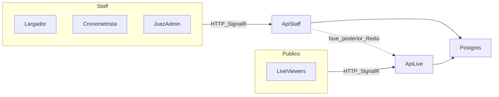

# Plan: API Staff + API Live

> Guardado para retomar más adelante. No implementado todavía.
> Origen: diseño SportTrack (aislamiento staff vs público).

## Overview

Separar **api-staff** (operación del evento) y **api-live** (público) sobre el mismo código y repo, con despliegues distintos en Render y front que elige URL por pantalla, sin partir el monorepo.

## Decisiones cerradas

### Dos APIs ≠ dos repos

| Qué | Cuántos | Significado |
|-----|---------|-------------|
| **APIs en Render** | **2** | Dos Web Services: `api-staff` y `api-live` (dos URLs, dos procesos, facturación aparte) |
| **Código / Git** | **1** | El mismo repo `SportTrack-Sigdef` se despliega dos veces; solo cambia `APP_ROLE` |
| **Base de datos** | **1** | Ambos servicios usan la misma Postgres |

Ejemplo:

```text
Render:
  sporttrack-api-staff  ← deploy del mismo repo, APP_ROLE=Staff
  sporttrack-api-live   ← deploy del mismo repo, APP_ROLE=Live

GitHub:
  SportTrack-Sigdef     ← un solo código (no hay SportTrack-Staff y SportTrack-Live)
```

Así evitamos mantener dos bases de código gemelas. Las “2 APIs” son **2 instancias desplegadas**, no 2 proyectos Git.

### Ejemplo concreto (cómo se “imagina”)

Hoy tenés algo así:

```text
GitHub:  SportTrack-Sigdef/     ← un proyecto .NET
Render:  sporttrack-api         ← 1 Web Service que corre ese código
URL:     https://sporttrack-api.onrender.com
```

Con el plan, **no creás** `SportTrack-Sigdef-Live` en Visual Studio. Creás **otro Web Service en Render** que apunta al **mismo** repo:

```text
GitHub:  SportTrack-Sigdef/          ← sigue siendo UN solo proyecto .NET

Render servicio 1:
  nombre:     sporttrack-api-staff
  repo:       SportTrack-Sigdef      ← mismo
  branch:     main                   ← mismo
  env:        APP_ROLE=Staff
  URL:        https://api-staff.onrender.com

Render servicio 2:
  nombre:     sporttrack-api-live
  repo:       SportTrack-Sigdef      ← mismo
  branch:     main                   ← mismo
  env:        APP_ROLE=Live
  URL:        https://api-live.onrender.com
```

En el código, al arrancar:

```csharp
// Pseudocódigo en Program.cs
var role = Environment.GetEnvironmentVariable("APP_ROLE") ?? "All";
// Staff → acepta largada / tiempos
// Live  → acepta espectadores / lecturas
// All   → todo (como ahora, un solo servicio)
```

Misma solución, mismo `TimingHub.cs`, mismos controllers. Cambia el **comportamiento según la variable de entorno** del proceso que esté corriendo.

Front:

```text
Juez / largador  →  https://api-staff.onrender.com
Live público     →  https://api-live.onrender.com
```

Si mañana arreglás un bug en la largada, hacés **un** commit y Render redeploya **los dos** servicios desde el mismo código (cada uno con su `APP_ROLE`).

Lo que **no** haríamos:

```text
❌ Nuevo proyecto SportTrack.Api.Live en Visual Studio
❌ Copiar pegar todo el backend
❌ Mantener dos repos con el mismo bug corregido dos veces
```

- **Rol por env**: `APP_ROLE=All|Staff|Live` (default `All` = comportamiento actual, sin romper prod / un solo servicio).
- **Misma Postgres** para ambos servicios.
- **Front** (`SportTrack-Front`): `VITE_API_STAFF_URL` + `VITE_API_LIVE_URL` (en fase temprana ambas pueden apuntar a la misma URL).
- **Redis** no en el primer corte: llega en fase posterior cuando staff y live deban sincronizar SignalR en tiempo real entre procesos.
- **Alcance Staff**: consolas de competencia (largador, cronometrista, jueces) + admin que ya usa el hub de operadores. El Live público solo habla con api-live.

## Arquitectura objetivo



## Cómo queda en Git

```text
SportTrack-Sigdef/     # mismo código, 2 servicios Render
SportTrack-Front/      # dos base URLs por env

Branches / PRs secuenciales sobre main:
1. feat/api-role-config
2. feat/front-dual-api-urls
3. chore/render-dual-services-docs
4. feat/redis-backplane          # más adelante
```

Un solo `main`. Los dos Web Services de Render apuntan al **mismo repo/branch**; solo cambian variables de entorno.

## Fases de implementación

### Fase 1 — Backend `APP_ROLE` (1 solo deploy)

Archivos clave a tocar:

- `SportTrack-Sigdef/Program.cs`: leer `APP_ROLE`, registrar política/filtro.
- `SportTrack-Sigdef.Controladores/Hubs/TimingHub.cs`:
  - `Staff`: joins de operadores + writes (`RequestStartRace`, `SendTime`, etc.).
  - `Live`: joins de espectadores / grupos de evento para broadcast de lectura.
  - `All`: todo como hoy.
- Controllers de timing/fases: en `Live`, rechazar writes de competencia con 403 claro.
- `Controllers/HealthController.cs`: exponer `role` en el JSON.

Default `APP_ROLE=All` → merge seguro sin segundo servicio.

**Todo:** Backend `APP_ROLE=All|Staff|Live` + filtros TimingHub/controllers + Health.role

### Fase 2 — Front dual URL

- Extender `src/services/api.js` (o clientes separados) para staff vs live.
- `src/services/TimingSignalRService.js`: hub URL según contexto (juez vs Live).
- Pantallas jueces/admin → staff; `src/pages/Home/LiveResults.jsx` → live.
- `.env.example`: documentar `VITE_API_STAFF_URL` / `VITE_API_LIVE_URL` (fallback a la URL única actual).

**Todo:** Front `VITE_API_STAFF_URL` / `VITE_API_LIVE_URL` + TimingSignalR por contexto

### Fase 3 — Render: segundo Web Service

- `sporttrack-api-staff`: `APP_ROLE=Staff`, instancia paga always-on (mínimo Starter).
- `sporttrack-api-live`: `APP_ROLE=Live`, Starter/Standard.
- Misma `DATABASE_URL` / connection string.
- Front Vercel: apuntar vars a cada host.
- Runbook corto en docs (cómo desplegar / rollback a `All`).

Sin Redis aún: el staff confirma largada en DB (HTTP/hub staff); el live se entera por lectura/reconnect/eventos ya existentes. Aceptable para validar aislamiento; no ideal para 1000 viewers con latencia cero.

**Todo:** Segundo Web Service Render + runbook; misma DB; front apunta URLs

### Fase 4 — Redis backplane (cuando el live grande lo exija)

- Render Key Value.
- SignalR Redis backplane + reemplazo de `IMemoryCache` live por caché distribuida (el código ya anticipa Redis en comentarios de cache).
- Staff publica; live retransmite a grupos públicos.

**Todo:** Redis backplane SignalR + cache distribuida cuando haga falta sync staff→live

## Criterio de aceptación por fase

| Fase | Listo cuando |
|------|----------------|
| 1 | Con `All` no cambia nada; con `Staff`/`Live` en local se respetan writes vs reads |
| 2 | Jueces y Live pueden usar URLs distintas o la misma sin romper |
| 3 | Saturar live no tumba largada en staff (prueba manual) |
| 4 | `RaceStarted` llega a viewers en api-live sin compartir proceso con staff |

## Fuera de alcance de este plan

- Aislar CPU/RAM de Render vía métricas en SuperAdmin (ya hay monitor de audiencia SignalR).
- Partir SaaS/federaciones en un tercer servicio.
- Subir planes de Render automáticamente desde código.

## Orden de trabajo cuando se retome

1. PR `feat/api-role-config`
2. PR `feat/front-dual-api-urls`
3. Crear 2º servicio en Render + vars front
4. Diferir Redis hasta medir latencia staff→live en un evento real

## Nota Render Free

Se pueden crear 2 APIs en Free (hasta 25 servicios Hobby), pero **ambas** tienen spin-down y comparten 750 horas Free/mes. Para aislar de verdad, **staff debe ser always-on (pago)**.
