# Diagrama Entidad-Relacion Completo — SportTrack SIGDEF

> **26 entidades · 36 relaciones · 11 enumeraciones**
> Generado desde los mappings de SportTrack-Sigdef (Entidades y Controladores). Julio 2026.

---

## Como usar este diagrama

Copia el bloque `erDiagram` de abajo y pegalo en:

- **[mermaid.live](https://mermaid.live/)** — editor online gratuito
- **GitHub/GitLab** (lo renderiza automaticamente en issues/PRs/READMEs)
- **VS Code** con extension "Markdown Preview Mermaid Support"
- **Notion**, **Obsidian**, **Confluence** (todos soportan Mermaid)

---

## Diagrama ER

```mermaid
erDiagram
    %% ==================== INSTITUCIONAL ====================
    Federacion {
        int IdFederacion PK
        string Sigla
        bool Activo
        string Nombre
        string Cuit
        string Email
        string Telefono
        string Direccion
        string BancoNombre
        string TipoCuenta
        string NumeroCuenta
        string TitularCuenta
        string EmailCobro
        int PlanSaaSId FK
        DateTime FechaAltaPlan
        DateTime FechaVencimientoPlan
        string FrecuenciaPago
        bool BloqueadaPorFaltaDePago
    }

    Club {
        int IdClub PK
        string Nombre
        string Siglas
        string Email
        string Telefono
        string Direccion
        string Ubicacion
        bool Activo
        int IdFederacion FK
        int PlanSaaSId FK
        string FrecuenciaPago
        DateTime FechaAltaPlan
        DateTime FechaVencimientoPlan
        bool BloqueadoPorFaltaDePago
        bool PagoAfiliacionAlDia
        bool SolicitudPagoPendiente
        EstadoPago EstadoMatricula
    }

    PlanSaaS {
        int Id PK
        string Nombre
        decimal Precio
        int MaxAtletas
        int MaxTorneosActivos
        bool ResultadosTiempoReal
        bool ExportacionExcel
        bool SoportePrioritario
    }

    Usuario {
        int IdUsuario PK
        string Username
        string PasswordHash
        string Email
        string RolFederacion
        int IdClub FK
        int IdFederacion FK
        DateTime FechaCreacion
        bool EstaActivo
        int IntentosFallidos
        DateTime UltimoAcceso
        string Nombre
        string Apellido
        string Dni
        string Telefono
        int ParticipanteId FK
    }

    %% ==================== CATALOGOS ====================
    Categoria {
        int Id PK
        string Nombre
        int EdadMin
        int EdadMax
    }

    Bote {
        int Id PK
        string Tipo
    }

    Distancia {
        int Id PK
        DistanciaRegataEnum DistanciaRegata
        int GapSugerido
    }

    Prueba {
        int IdPrueba PK
        string Nombre
        int TipoBote FK
        int CategoriaEdad FK
        int DistanciaId FK
        int SexoCompetencia
        string Descripcion
    }

    Sexo {
        int Id PK
        string Nombre
    }

    RolFederacion {
        int Id PK
        string Nombre
    }

    %% ==================== PERSONAS Y ROLES ====================
    Participante {
        int ParticipanteId PK
        string Nombre
        string Apellido
        DateTime FechaNacimiento
        int SexoId FK
        int CategoriaId FK
        string Pais
        int IdClub FK
        string Documento
        string Email
        string Telefono
        string Direccion
        bool PagoAfiliacionAlDia
    }

    AtletaFederacion {
        int ParticipanteId PK, FK
        int IdClub FK
        int IdFederacion FK
        EstadoPago EstadoPago
        bool PerteneceSeleccion
        CategoriaEdad Categoria
        DateTime FechaCreacion
        bool BecadoEnard
        bool BecadoSdn
        decimal MontoBeca
        bool PresentoAptoMedico
        DateTime FechaAptoMedico
    }

    EntrenadorFederacion {
        int ParticipanteId PK, FK
        int IdClub FK
        int IdFederacion FK
        bool PerteneceSeleccion
        string CategoriaSeleccion
        bool BecadoEnard
        bool BecadoSdn
        decimal MontoBeca
        bool PresentoAptoMedico
    }

    DelegadoFederacionClub {
        int IdParticipante FK
        int IdRol FK
        int IdFederacion FK
        int ClubIdClub FK
    }

    TutorFederacion {
        int ParticipanteId PK, FK
        string TipoTutor
    }

    AtletaFederacionTutor {
        int IdAtleta PK, FK
        int IdTutor PK, FK
        Parentesco Parentesco
    }

    %% ==================== EVENTOS ====================
    Evento {
        int IdEvento PK
        string Nombre
        DateTime Fecha
        DateTime FechaFin
        string Ubicacion
        EstadoEventoEnum Estado
        DateTime FechaCreacion
        DateTime FechaFinInscripciones
        bool EstaActivo
        string Descripcion
        string TipoEvento
        DateTime FechaInicioInscripciones
        string Ciudad
        string Provincia
        decimal PrecioBase
        int CupoMaximo
        bool TieneCronometraje
        bool RequiereCertificadoMedico
        string Observaciones
        int IdClub FK
        int IdFederacion FK
        bool InscripcionesHabilitadas
        TimeSpan HoraInicioEvento
        int CarrilesDisponibles
        PerfilTiempoEnum PerfilTiempo
        TimeSpan HoraInicioReceso
        TimeSpan HoraFinReceso
        bool SinReceso
        int GapEntrePruebas
        bool PermitirCombinadas
        bool UsarGapVariable
        string TimeZoneId
        string CategoriasHabilitadas
        string BotesHabilitados
        string DistanciasHabilitadas
        DateTime FechaActualizacion
        bool RestringirSoloCategoriaPropia
        bool PermitirSub23EnSenior
        bool PermitirMasterBajarASenior
        bool PermitirCompletarK4
        bool LimitacionBotesAB
    }

    EventoPrueba {
        int IdEventoPrueba PK
        int IdEvento FK
        int IdPrueba FK
        DateTime FechaHora
        int MaxParticipantes
        string Pista
        EstadoEventoEnum Estado
        string PlanProgresionAsignado
        decimal PrecioCategoria
    }

    %% ==================== COMPETICION ====================
    Inscripcion {
        int IdInscripcion PK
        int IdEventoPrueba FK
        int IdParticipante FK
        DateTime FechaInscripcion
        string NumeroCompetidor
        bool EsCabezaDeSerie
        EstadoInscripcionEnum Estado
        bool Pagado
    }

    InscripcionTripulante {
        int Id PK
        int InscripcionId FK
        int ParticipanteId FK
        int PosicionEnBote
    }

    Etapa {
        int Id PK
        int EventoPruebaId FK
        string Nombre
        int Orden
    }

    Fase {
        int Id PK
        int EtapaId FK
        string NombreFase
        int NumeroFase
        DateTime FechaHoraProgramada
        string Estado
        DateTime FechaHoraInicioReal
        DateTime FechaHoraFinReal
    }

    Resultado {
        int Id PK
        int FaseId FK
        int InscripcionId FK
        int Carril
        bool EsCabezaDeSerie
        TimeSpan TiempoOficial
        int Posicion
        decimal Puntos
        decimal VelocidadMedia
        EstadoResultadoEnum Estado
        string Observaciones
        int FaseOrigenId
        string ReglaClasificacionAplicada
        DateTime FechaRegistro
        DateTime FechaActualizacion
        string UsuarioRegistro
        string UsuarioActualizacion
    }

    Penalizacion {
        int Id PK
        int ResultadoId FK
        string Tipo
        string Motivo
        decimal Segundos
    }

    ReglaProgresion {
        int Id PK
        int EventoPruebaId FK
        int FaseOrigen
        int FaseDestino
        int CantidadClasifican
    }

    %% ==================== PAGOS Y DOCUMENTACION ====================
    PagoFederacionTransaccion {
        int IdPago PK
        string Concepto
        decimal Monto
        EstadoPagoTransaccion Estado
        DateTime FechaCreacion
        DateTime FechaAprobacion
        int IdParticipante FK
        int IdClub FK
        string IdMercadoPago
    }

    DocumentacionFederacionPersona {
        int Id PK
        int ParticipanteId FK
        string TipoDocumento
        string ArchivoUrl
    }

    %% ==================== RELACIONES ====================
    %% Institucional
    Federacion ||--o{ Club                     : "IdFederacion"
    Federacion ||--o{ Evento                   : "IdFederacion"
    Federacion ||--o{ Usuario                  : "IdFederacion"
    Federacion ||--o{ AtletaFederacion         : "IdFederacion"
    Federacion ||--o{ EntrenadorFederacion     : "IdFederacion"
    Federacion ||--o{ DelegadoFederacionClub   : "IdFederacion"
    PlanSaaS ||--o{ Federacion                : "PlanSaaSId"
    PlanSaaS ||--o{ Club                      : "PlanSaaSId"

    Club ||--o{ Participante                   : "IdClub"
    Club ||--o{ Usuario                        : "IdClub"
    Club ||--o{ AtletaFederacion               : "IdClub"
    Club ||--o{ EntrenadorFederacion           : "IdClub"
    Club ||--o{ DelegadoFederacionClub         : "ClubIdClub"
    Club ||--o{ PagoFederacionTransaccion      : "IdClub"

    %% Personas
    Participante ||--o| AtletaFederacion       : "ParticipanteId"
    Participante ||--o| EntrenadorFederacion   : "ParticipanteId"
    Participante ||--o| TutorFederacion        : "ParticipanteId"
    Participante ||--o| Usuario                : "ParticipanteId"
    Participante ||--o{ Inscripcion            : "IdParticipante"
    Participante ||--o{ InscripcionTripulante  : "ParticipanteId"
    Participante ||--o{ PagoFederacionTransaccion : "IdParticipante"
    Participante ||--o{ DocumentacionFederacionPersona : "ParticipanteId"
    Participante }o--|| Sexo                   : "SexoId"
    Participante }o--|| Categoria              : "CategoriaId"

    %% N:M Atleta-Tutor
    AtletaFederacion ||--o{ AtletaFederacionTutor : "IdAtleta"
    TutorFederacion ||--o{ AtletaFederacionTutor  : "IdTutor"

    %% Catalogos -> Prueba
    Categoria ||--o{ Prueba                    : "CategoriaEdad"
    Bote ||--o{ Prueba                        : "TipoBote"
    Distancia ||--o{ Prueba                   : "DistanciaId"

    %% Evento N:M Prueba
    Evento ||--o{ EventoPrueba                 : "IdEvento"
    Prueba ||--o{ EventoPrueba                : "IdPrueba"

    %% Competicion
    EventoPrueba ||--o{ Inscripcion            : "IdEventoPrueba"
    EventoPrueba ||--o{ Etapa                  : "EventoPruebaId"
    EventoPrueba ||--o{ ReglaProgresion        : "EventoPruebaId"
    Inscripcion ||--o{ InscripcionTripulante   : "InscripcionId"
    Inscripcion ||--o{ Resultado               : "InscripcionId"
    Etapa ||--o{ Fase                         : "EtapaId"
    Fase ||--o{ Resultado                     : "FaseId"
    Resultado ||--o{ Penalizacion             : "ResultadoId"
```

