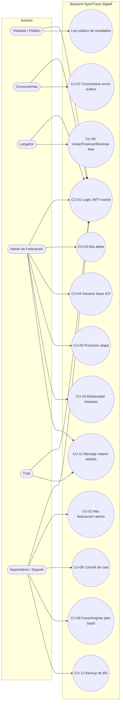

# 02 · Casos de Uso

**Última actualización: 2026-09-27**
**Notación:** UML (casos de uso), IDs `CU-##`.

---

## Índice

1. [Diagrama de casos de uso](#1-diagrama-de-casos-de-uso)
2. [Actores](#2-actores)
3. [Especificación de casos de uso](#3-especificación-de-casos-de-uso)
   - [CU-01 · Login y emisión de JWT + cookie](#cu-01--login-y-emisión-de-jwt--cookie)
   - [CU-02 · Alta de federación con administrador (SaaS)](#cu-02--alta-de-federación-con-administrador-saas)
   - [CU-03 · Alta completa de atleta](#cu-03--alta-completa-de-atleta)
   - [CU-04 · Generar fases automáticamente](#cu-04--generar-fases-automáticamente)
   - [CU-05 · Promover etapa ICF](#cu-05--promover-etapa-icf)
   - [CU-06 · Iniciar / finalizar / reiniciar fase](#cu-06--iniciar--finalizar--reiniciar-fase)
   - [CU-07 · Cronometrar y enviar tiempos (outbox)](#cu-07--cronometrar-y-enviar-tiempos-outbox)
   - [CU-08 · Commit de cola de timing (soporte)](#cu-08--commit-de-cola-de-timing-soporte)
   - [CU-09 · Crear / asignar plan SaaS](#cu-09--crear--asignar-plan-saas)
   - [CU-10 · Alta y aceptación de traspaso](#cu-10--alta-y-aceptación-de-traspaso)
   - [CU-11 · Mensaje masivo aislado](#cu-11--mensaje-masivo-aislado)
   - [CU-12 · Backup de base de datos](#cu-12--backup-de-base-de-datos)

---

## 1. Diagrama de casos de uso

---

## 2. Actores

| Actor | Casos de uso principales |
|-------|--------------------------|
| Visitante/Público | CU-01, Live |
| Cronometrista | CU-01, CU-07 |
| Largador | CU-01, CU-06 |
| Admin de Federación | CU-01, CU-03, CU-04, CU-05, CU-06, CU-10, CU-11 |
| Club | CU-01, CU-11 |
| SuperAdmin / Soporte | CU-01, CU-02, CU-08, CU-09, CU-12 |

---

## 3. Especificación de casos de uso

### CU-01 · Login y emisión de JWT + cookie

| Campo | Valor |
|-------|-------|
| **ID** | CU-01 |
| **Actores** | Todos los usuarios registrados |
| **RF / RN** | RF-01, RF-09 · RN-04, RN-09 |
| **Precondición** | El usuario existe, está `EstaActivo` y no bloqueado por pago/vencimiento |
| **Postcondición** | JWT emitido y devuelto (body + cookie `X-Access-Token`) |

**Flujo principal**

1. El actor envía `POST api/Auth/login` con `username`/`password` (rate limit `auth`, 20/min/IP) y cabecera `X-Client-App`.
2. `AuthService` valida credenciales (BCrypt) y el estado del usuario (activo, plan al día, sistema de origen con acceso).
3. `TokenService` emite JWT firmado con HMAC-SHA512.
4. El controlador setea la cookie `X-Access-Token` y devuelve `200` con el token.
5. El cliente usa `Authorization: Bearer` (preferido) o la cookie.

**Flujos alternativos**

- **A1 — Credenciales inválidas:** incrementa el contador de intentos; a los 5 fallos `EstaActivo = false`; devuelve `401`.
- **A2 — Sin acceso por sistema de origen:** `X-Client-App` sin flag `Acceso*` → `401/403`.
- **A3 — Bloqueado por pago o vencido:** `403`.
- **A4 — Exceso de intentos por IP:** `429`.

**Reglas:** cookie-first implementado (`OnMessageReceived` prioriza `Authorization` → `?access_token` → cookie `X-Access-Token`).

---

### CU-02 · Alta de federación con administrador (SaaS)

| Campo | Valor |
|-------|-------|
| **ID** | CU-02 |
| **Actor** | SuperAdmin |
| **RF / RN** | RF-42 · RN-03, RN-04 |
| **Precondición** | SuperAdmin autenticado |
| **Postcondición** | Federación creada con un usuario Admin asociado |

**Flujo principal**

1. `POST api/SaaS/create-federacion` con datos de federación y admin.
2. `SaaSService.CreateFederacionWithAdminAsync` crea la federación y el usuario Admin.
3. Se devuelve la federación creada.

**Flujos alternativos**

- **A1 — Duplicado:** la base devuelve `23505` (unique violation) y el servicio lo mapea a un error de conflicto legible.

---

### CU-03 · Alta completa de atleta

| Campo | Valor |
|-------|-------|
| **ID** | CU-03 |
| **Actor** | Admin de Federación |
| **RF / RN** | RF-27 · RN-05 |
| **Precondición** | Admin autenticado con federación resuelta |
| **Postcondición** | Atleta federado creado/actualizado, con tutores asociados |

**Flujo principal**

1. `POST api/Atleta/full` con datos del atleta (documento, categoría, club) y tutores.
2. `AltaAtletaService` normaliza el documento y busca existencia (3 estrategias).
3. Si no existe, hace `UpsertParticipanteAsync`; luego `EnsureAtletaFederacionAsync` para la federación resuelta.
4. Se asocian los tutores (`AtletaTutor`).

**Flujos alternativos**

- **A1 — Documento duplicado:** se reutiliza/actualiza el registro existente.
- **A2 — Federación no resoluble:** `ResolverFederacionIdAsync` falla → `400`.

> ⚠️ **Deuda:** el tope `MaxAtletas` del plan **no** se valida aún.

---

### CU-04 · Generar fases automáticamente

| Campo | Valor |
|-------|-------|
| **ID** | CU-04 |
| **Actor** | Admin / Operador de competencia |
| **RF / RN** | RF-14 · RN-01, RN-11 |
| **Precondición** | `EventoPrueba` con participantes confirmados; plan ICF resoluble |
| **Postcondición** | Fases creadas con carriles y cabezas de serie asignados |

**Flujo principal**

1. `POST api/Fases/Generar/{eventoPruebaId}` (rol `CompetitionOperators`).
2. `ProgressionPlanRegistry.ResolveDefaultPlan` elige plan por cantidad (10-18→A … 64-72→G, variante 1/2).
3. `FaseService.GenerarFasesAutoAsync` crea 9 carriles con prioridad `[5,4,6,3,7,2,8,1,9]`, distribuye cabezas de serie y **pre-genera** SF/finales.
4. Valida carriles duplicados; audita `GENERATE_HEATS_AUTO`.

**Flujos alternativos**

- **A1 — Carril ocupado:** `ProgressionEngine.Assign` lanza excepción → `400`.
- **A2 — Cantidad no soportada:** plan no resoluble → `400`.

---

### CU-05 · Promover etapa ICF

| Campo | Valor |
|-------|-------|
| **ID** | CU-05 |
| **Actor** | Admin / Operador |
| **RF / RN** | RF-17 · RN-01 |
| **Precondición** | Resultados completos de la ronda actual |
| **Postcondición** | Clasificados asignados a la siguiente ronda (A/B/C por mejor tiempo) |

**Flujo principal**

1. `POST api/Fases/Promover/{eventoPruebaId}`.
2. `FaseService.PromoverFasesAsync` valida resultados completos, calcula rankings (excluye `Descalificado`/`DNS`/`DNF`, prefiere `TiempoOficial`) y asigna clasificados.
3. Audita `PROMOTE_STAGE`.

**Flujos alternativos**

- **A1 — Resultados incompletos:** `400`, sin cambios.

---

### CU-06 · Iniciar / finalizar / reiniciar fase

| Campo | Valor |
|-------|-------|
| **ID** | CU-06 |
| **Actor** | Largador / Operador |
| **RF / RN** | RF-18 · RN-07 |
| **Precondición** | Fase en estado compatible |
| **Postcondición** | Fase en `EnCurso` / `Finalizada` / `Programada` (reseteo) |

**Flujo principal**

1. **Iniciar:** `POST api/Fases/{id}/Iniciar` → fase `EnCurso`; emite `RaceStarted`/`globalRaceStarted`.
2. **Finalizar:** `POST api/Fases/{id}/Finalizar` → posición + oficial; emite `RaceFinished`/`globalRaceOfficialized`.
3. **Reiniciar:** `POST api/Fases/{id}/Reiniciar` con motivo (≥5 caracteres) → limpia tiempos, vuelve a `Programada`, audita `RESET_RACE`, emite `RaceReset`.
4. **Enviar a revisión:** `POST api/Fases/{id}/EnviarARevision` → emite `RaceInReview`.

**Flujos alternativos**

- **A1 — Motivo de reseteo insuficiente:** `400`.

> La vía SignalR equivalente es `RequestStartRace` / `RequestResetRace` (hub `/hubs/timing`).

---

### CU-07 · Cronometrar y enviar tiempos (outbox)

| Campo | Valor |
|-------|-------|
| **ID** | CU-07 |
| **Actor** | Cronometrista |
| **RF / RN** | RF-48 · RN-06 |
| **Precondición** | Cronometrista autenticado (sesión 24 h) |
| **Postcondición** | Tiempos encolados o transmitidos en vivo |

**Flujo principal (online)**

1. Se une a `race_{faseId}` (`JoinRaceGroup`) y consulta hora con `GetServerTime`.
2. Envía `SendTime` (o `RecordLap`) → el hub retransmite `TimeReceived` / `globalTimeReceived`.
3. `UpdateResultStatus` actualiza el estado del resultado.

**Flujo principal (offline)**

1. Sin conexión, encola cada tiempo con `POST api/timing-outbox` (upsert por `(FaseId, Username)`, TTL 24 h).
2. `GET api/timing-outbox/pending` lista pendientes; `POST api/timing-outbox/flush` intenta vaciado.

**Flujos alternativos**

- **A1 — Entradas expiradas:** `PurgeExpiredAsync` las elimina tras 24 h.

> No existe token de cronometrista separado; se usa el JWT estándar con `SessionLifetimePolicy` extendida.

---

### CU-08 · Commit de cola de timing (soporte)

| Campo | Valor |
|-------|-------|
| **ID** | CU-08 |
| **Actor** | SuperAdmin / Soporte |
| **RF / RN** | RF-48, RF-49 · RN-06 |
| **Precondición** | Fase con envíos pendientes y carrera finalizada/lista |
| **Postcondición** | Resultados aplicados y fase finalizada o en revisión |

**Flujo principal**

1. `POST api/Support/timing-outbox/{faseId}/commit` (o `POST api/timing-outbox/{faseId}/commit`).
2. `TimingOutboxService.CommitAsync` aplica `BatchUpdate` de resultados.
3. Ejecuta `FinalizarFase` o `EnviarARevision` según el caso.
4. Marca los envíos como procesados; `DELETE api/Support/timing-outbox/{id}` permite descartar entradas.

**Flujos alternativos**

- **A1 — Sin pendientes:** operación no-op con mensaje informativo.

---

### CU-09 · Crear / asignar plan SaaS

| Campo | Valor |
|-------|-------|
| **ID** | CU-09 |
| **Actor** | SuperAdmin |
| **RF / RN** | RF-39, RF-40, RF-41 · RN-04, RN-14 |
| **Precondición** | SuperAdmin autenticado |
| **Postcondición** | Plan actualizado y/o asignado a club/federación |

**Flujo principal**

1. `GET api/SaaS/planes` (público) lista planes con flags derivados.
2. `PUT api/SaaS/planes/{id}` actualiza precios; `PrecioAnual = Precio × 12 × (1 − Descuento/100)`; `MaxTorneosActivos = -1`.
3. `POST api/SaaS/asignar-plan` asigna plan a club.
4. `GET api/SaaS/clubes-status` muestra uso de atletas vs `MaxAtletas` y `PlanAlDia`.

**Flujos alternativos**

- **A1 — Rol no permitido por plan:** el alta de usuario falla vía `CanCreateRole`.

---

### CU-10 · Alta y aceptación de traspaso

| Campo | Valor |
|-------|-------|
| **ID** | CU-10 |
| **Actor** | Admin / Club de origen |
| **RF / RN** | RF-29 · RN-08 |
| **Precondición** | Periodo de traspaso activo; atleta federado |
| **Postcondición** | Solicitud creada, aceptada/rechazada por origen y aprobada/rechazada |

**Flujo principal**

1. `GET api/Traspaso/periodo-activo` verifica periodo; `GET api/Traspaso/buscar-atletas` busca candidatos.
2. `POST api/Traspaso` crea la solicitud.
3. `GET api/Traspaso/{id}/validaciones` muestra reglas aplicables.
4. `POST api/Traspaso/{id}/aceptar-origen` o `.../rechazar-origen`.
5. `POST api/Traspaso/{id}/aprobar` (o `.../forzar`) o `.../rechazar`; `.../cancelar`.
6. `GET api/Traspaso/auditoria` y `GET api/Traspaso/export/csv` para trazabilidad.

---

### CU-11 · Mensaje masivo aislado

| Campo | Valor |
|-------|-------|
| **ID** | CU-11 |
| **Actor** | SuperAdmin / Admin |
| **RF / RN** | RF-37, RF-38 · RN-02 |
| **Precondición** | Actor con rol habilitado para masivo |
| **Postcondición** | Campaña creada y mensajes entregados/notificados |

**Flujo principal**

1. `POST api/mensajes/hilos/masivo` con contenido y destinatarios (solo SuperAdmin/Admin).
2. `MensajeService` filtra destinatarios por federación y sistema de origen (`X-Client-App`).
3. Se crea `CampanaEnvio` y se notifica por SignalR (`newMessageReceived` → `user_{username}`).
4. `GET api/mensajes/campanas` y `.../campanas/{id}` consultan el resultado.

**Flujos alternativos**

- **A1 — Rol no autorizado:** `403`.
- **A2 — Intento de cruzar sistemas:** el filtro de origen excluye destinatarios fuera del sistema.

---

### CU-12 · Backup de base de datos

| Campo | Valor |
|-------|-------|
| **ID** | CU-12 |
| **Actor** | SuperAdmin / Soporte |
| **RF / RN** | RF-47 |
| **Precondición** | SuperAdmin autenticado; `pg_dump` disponible (≥ versión del server) |
| **Postcondición** | Archivo de backup descargado e historial actualizado |

**Flujo principal**

1. `GET api/Backup/download?scope=full` → `BackupService` ejecuta `pg_dump` con `PGPASSWORD` por variable de entorno.
2. `GET api/Backup/download?scope=federacion&idFederacion=N` → genera INSERTs de esa federación.
3. `GET api/Backup/history` lee el historial desde Auditoría.

**Flujos alternativos**

- **A1 — `pg_dump` ausente o mismatch de versión:** error controlado; revisar contenedor (`postgresql-client-18`).

---

## Pie de página

- ➡️ [03 · Diagramas de Flujo](./03-Diagramas-de-Flujo.md)
- ➡️ [04 · Manual de Uso de la API](./04-Manual-de-Uso-API.md)
- ⬅️ [01 · Requerimientos de Usuario](./01-Requerimientos-Usuario.md) · [Volver al índice del Pack](./README.md)
