# 03 · Diagramas de Flujo

**Última actualización: 2026-09-27**
**Notación:** Mermaid (flowchart, stateDiagram-v2, sequenceDiagram). Todos los diagramas verificados contra el código.

---

## Índice

1. [Pipeline HTTP y autenticación/autorización](#1-pipeline-http-y-autenticaciónautorización)
2. [Ciclo de vida evento / fase / resultado](#2-ciclo-de-vida-evento--fase--resultado)
3. [Motor de progresión ICF](#3-motor-de-progresión-icf)
4. [Cronometraje SignalR + outbox](#4-cronometraje-signalr--outbox)
5. [Reseteo de regata](#5-reseteo-de-regata)
6. [Enforcement de planes SaaS](#6-enforcement-de-planes-saas)
7. [Mensajería aislada por sistema de origen](#7-mensajería-aislada-por-sistema-de-origen)
8. [Secuencia de login](#8-secuencia-de-login)
9. [Backup](#9-backup)

---

## 1. Pipeline HTTP y autenticación/autorización

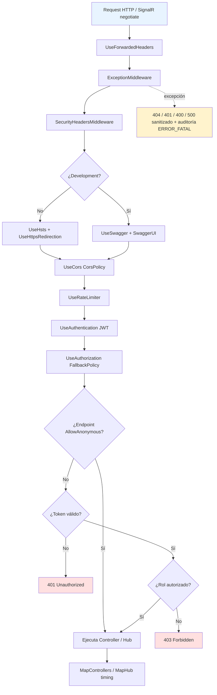

**Orden real del pipeline (`Program.cs`):** `ExceptionMiddleware → SecurityHeadersMiddleware → HSTS/HTTPS (no Dev) → Swagger (Dev) → CORS → RateLimiter → Authentication → Authorization → MapControllers → MapHub<TimingHub>('/hubs/timing').AllowAnonymous()`.

**Resolución del token (`OnMessageReceived`):** `Authorization: Bearer` → `?access_token` (SignalR) → cookie `X-Access-Token`.

---

## 2. Ciclo de vida evento / fase / resultado

### 2.1 Estado del evento

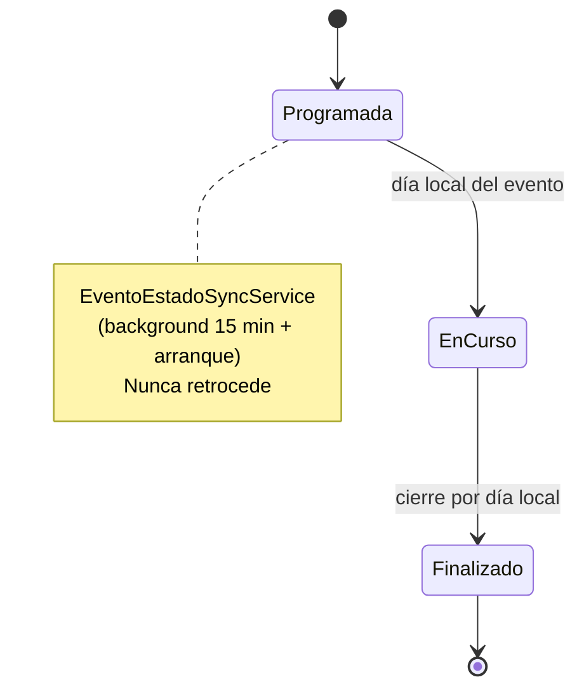

### 2.2 Estado de la fase

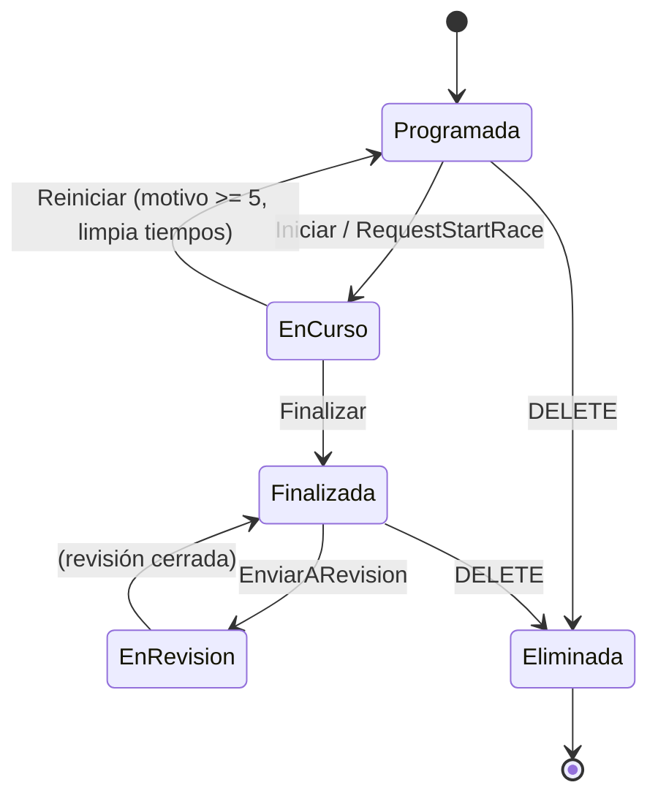

### 2.3 Estado del resultado

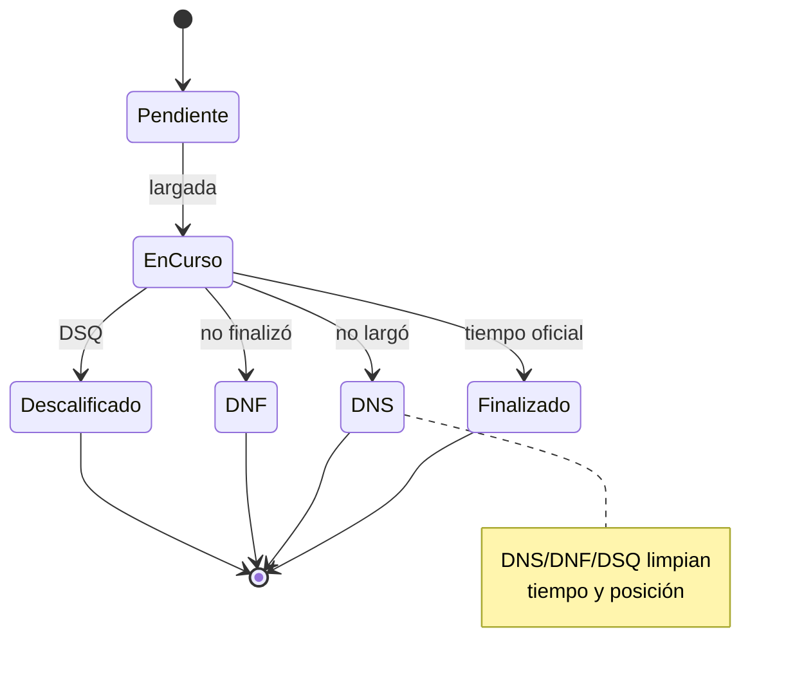

---

## 3. Motor de progresión ICF

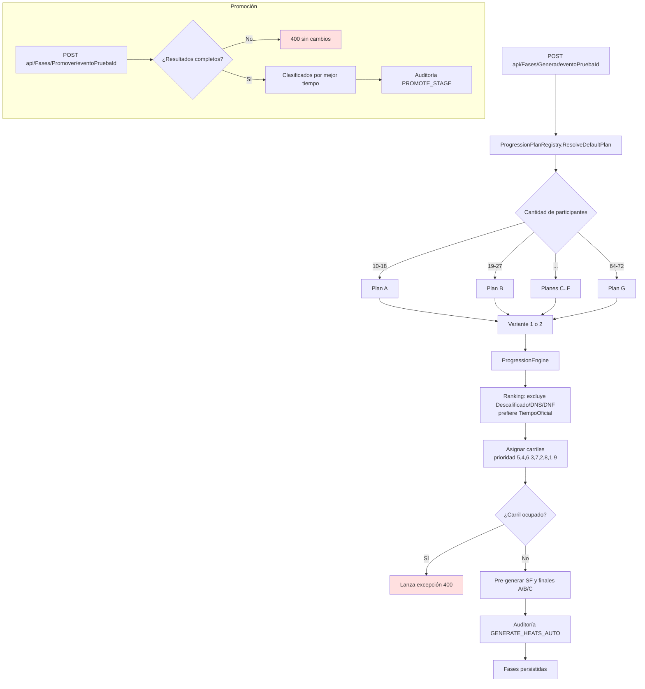

**Alias:** `PlanX` (comodín). **Maratón:** `GenerarLargadaMaraton` crea una única fase `Largada` con `Carril = NumeroCompetidor` y audita `GENERATE_LARGADA_MARATON`.

---

## 4. Cronometraje SignalR + outbox

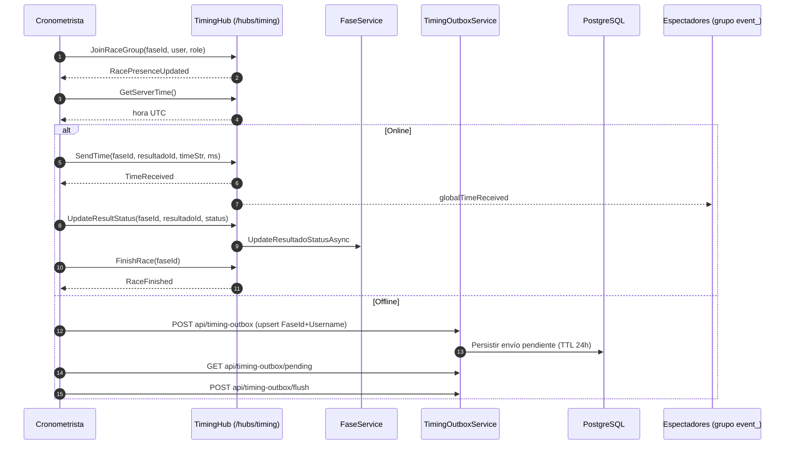

---

## 5. Reseteo de regata

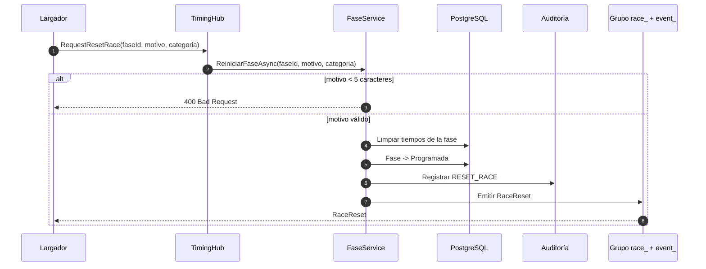

---

## 6. Enforcement de planes SaaS

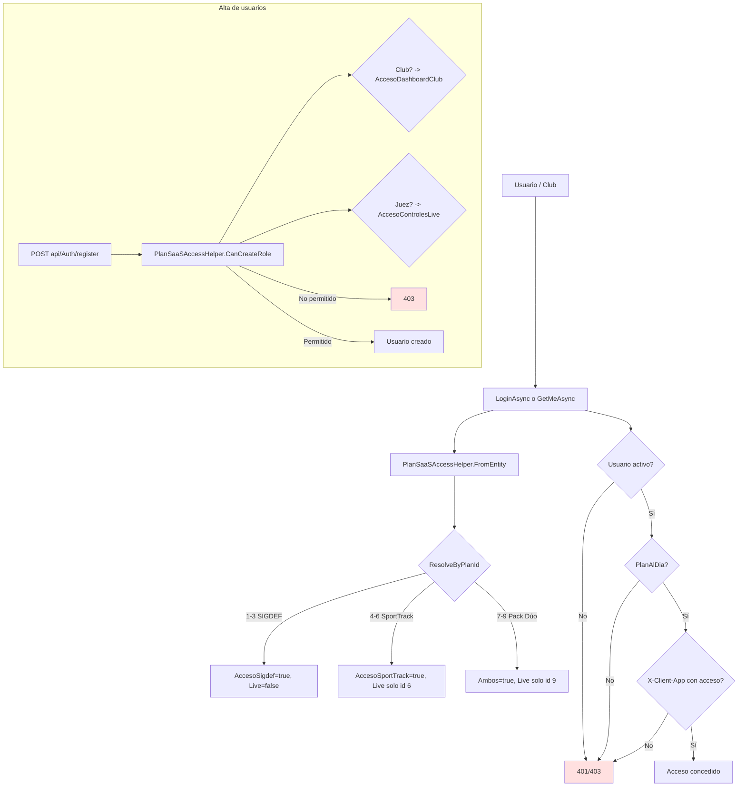

> ⚠️ **Deuda:** `MaxAtletas` no se aplica aún en el alta de atletas; `MaxTorneosActivos` quedó en `-1` (sin enforcement efectivo).

---

## 7. Mensajería aislada por sistema de origen

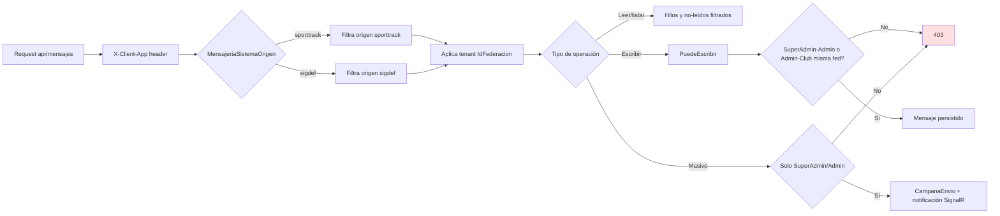

**Notificación:** `newMessageReceived` → grupo `user_{username}`.

---

## 8. Secuencia de login

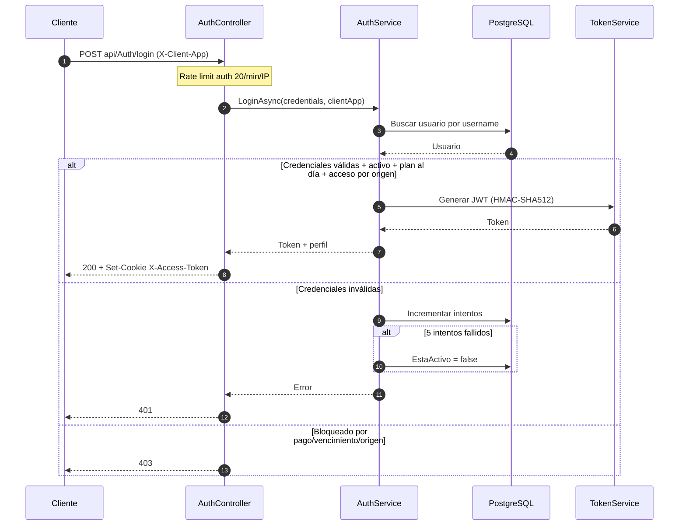

---

## 9. Backup

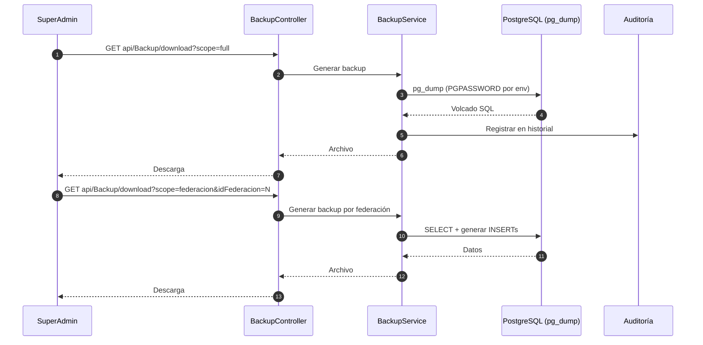

---

## Pie de página

- ➡️ [04 · Manual de Uso de la API](./04-Manual-de-Uso-API.md)
- ➡️ [05 · Manual Técnico](./05-Manual-Tecnico.md)
- ⬅️ [02 · Casos de Uso](./02-Casos-de-Uso.md) · [Volver al índice del Pack](./README.md)
