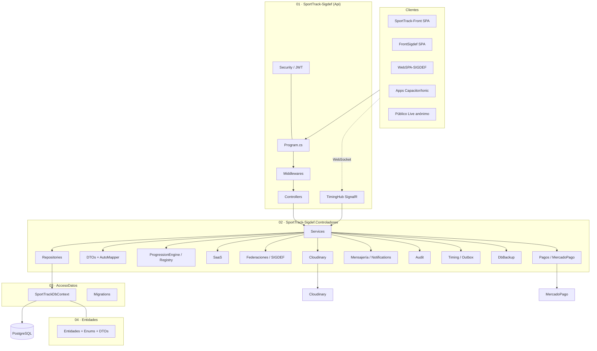
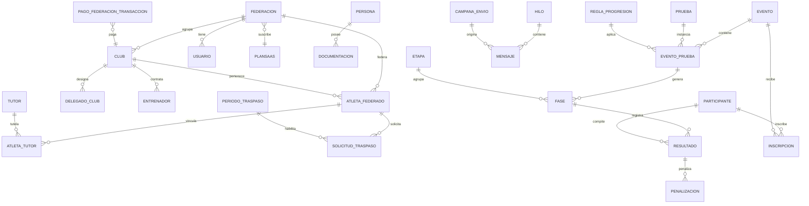

# 05 · Manual Técnico

**Última actualización: 2026-09-27**
**Audiencia:** desarrolladores backend, DevOps y mantenimiento.

---

## Índice

1. [Arquitectura](#1-arquitectura)
2. [Stack real](#2-stack-real)
3. [Estructura de la solución](#3-estructura-de-la-solución)
4. [Arranque y `Program.cs`](#4-arranque-y-programcs)
5. [Catálogo de controllers (rutas y roles)](#5-catálogo-de-controllers-rutas-y-roles)
6. [Servicios clave](#6-servicios-clave)
7. [Modelo de datos](#7-modelo-de-datos)
8. [Seguridad](#8-seguridad)
9. [SignalR](#9-signalr)
10. [Observabilidad y auditoría](#10-observabilidad-y-auditoría)
11. [Backups](#11-backups)
12. [Docker y despliegue](#12-docker-y-despliegue)
13. [Deuda técnica y discrepancias conocidas](#13-deuda-técnica-y-discrepancias-conocidas)
14. [Migraciones y seed](#14-migraciones-y-seed)
15. [Estrategia offline / outbox](#15-estrategia-offline--outbox)
16. [Testing y mantenimiento](#16-testing-y-mantenimiento)

---

## 1. Arquitectura

Arquitectura en capas con separación por proyectos y comunicación por interfaces (Services/Repositories + DI).



---

## 2. Stack real

| Componente | Versión / detalle |
|------------|-------------------|
| Framework | **.NET 10** (`net10.0`) — *recién migrado desde .NET 8* |
| Lenguaje | C# |
| Web | ASP.NET Core Web API |
| ORM | EF Core + **Npgsql 10.0.3** |
| Base de datos | PostgreSQL 14+ (Render PG 18.x) |
| Tiempo real | SignalR |
| Auth | JWT HMAC-SHA512; BCrypt para contraseñas |
| Mapeo | AutoMapper (`MappingProfile`) |
| Cache | `IMemoryCache` + `ILiveCacheService` (TTL 30–45 s) |
| Archivos | Cloudinary (`CloudinarySettings`) con fallback local |
| Pagos | `mercadopago-sdk` |
| Serialización | `System.Text.Json` con `ReferenceHandler.IgnoreCycles` |
| Codificación | UTF-8 forzado por `Directory.Build.props` |

---

## 3. Estructura de la solución

`SportTrack-Sigdef.sln` — 4 proyectos:

| Proyecto | Rol | Contenido clave |
|----------|-----|-----------------|
| `01 · SportTrack-Sigdef` | Api / composición | `Program.cs`, `Controllers/**`, `Middleware/**`, `Security/**`, CORS, JWT, Swagger, SignalR |
| `02 · SportTrack-Sigdef.Controladores` | Lógica de aplicación | `Services/Repositories`, `DTOs`, `Mappings` (AutoMapper), `Hubs`, `SaaS`, motor de progresión ICF (`Fase/Progression`), `Federaciones` (SIGDEF), `Pago`, `PagosSIGDEF`, `Mensajes`, `Notifications`, `Audience`, `Audit`, `Timing`, `DbBackup`, Cloudinary, mercadopago-sdk |
| `03 · SportTrack-Sigdef.AccesoDatos` | Persistencia | `SportTrackDbContext` + `Migrations`, Npgsql |
| `04 · SportTrack-Sigdef.Entidades` | Dominio | Entidades, enums, DTOs |

Estructura de carpetas relevante:

```
SportTrack-Sigdef/
├── SportTrack-Sigdef/                 (Api)
│   ├── Program.cs
│   ├── appsettings.json
│   ├── Dockerfile -> (raíz)
│   ├── Controllers/                   (Auth, Eventos, Fases, Resultados, ...)
│   │   └── SIGDEF/                    (Atleta, Club, Tutor, Traspaso, ...)
│   └── Middleware/                    (Exception, SecurityHeaders)
├── SportTrack-Sigdef.Controladores/
│   ├── Fase/Progression/              (ProgressionEngine, PlanRegistry)
│   ├── SaaS/                          (SaaSService, PlanSaaSAccessHelper)
│   ├── Federaciones/                  (AltaAtletaService, TraspasoService, ...)
│   ├── Hubs/                          (TimingHub, TimingGroups)
│   ├── Timing/, Audit/, DbBackup/, Audience/, Mensajes/, Notifications/
├── SportTrack-Sigdef.AccesoDatos/
└── SportTrack-Sigdef.Entidades/
```

---

## 4. Arranque y `Program.cs`

### 4.1 Cadena de conexión

`ResolveConnectionString`: usa `ConnectionStrings:DefaultConnection`; si no, la variable `DATABASE_URL`, normalizando `postgres://` → `postgresql://`.

### 4.2 Servicios registrados (resumen)

- `AddDbContext<SportTrackDbContext>` con `UseNpgsql` → `EnableRetryOnFailure(3)` + `CommandTimeout(30)`.
- `AddMemoryCache` (`SizeLimit = 1024`) + `ILiveCacheService`.
- Audience: `IAudiencePresenceTracker`, `IAudienceCapacitySettings`, `IAudienceMetricsService`, `AudienceSnapshotBackgroundService` (hosted).
- `AddSignalR`.
- CORS whitelist (`AllowedOrigins` + localhost dev + dominios propios).
- JWT con `TokenKeyResolver`; `OnMessageReceived` (Bearer → query → cookie).
- `FallbackPolicy = RequireAuthenticatedUser`.
- RateLimiter `auth` (20/min) y `live` (120/min).
- `AddControllers().AddApplicationPart(Controladores)` + `ReferenceHandler.IgnoreCycles`.
- Swagger solo en Development con `Bearer`.
- `UseForwardedHeaders` (limpia `KnownIPNetworks`/`KnownProxies` para Render).
- Migraciones automáticas al arranque + `EventoEstadoSyncService.SyncAllAsync`.
- `EventoEstadoBackgroundService` (hosted, 15 min).

### 4.3 Pipeline

```
ExceptionMiddleware
 → SecurityHeadersMiddleware
 → HSTS/HTTPS (no Dev)
 → Swagger (Dev)
 → CORS
 → RateLimiter
 → Authentication
 → Authorization
 → MapControllers
 → MapHub<TimingHub>("/hubs/timing").AllowAnonymous()
```

### 4.4 CORS (whitelist)

Orígenes por defecto: `localhost:3000/5173/5174`, `https://localhost`, `http://localhost`, `capacitor://localhost`, `ionic://localhost`, `sporttrack.pro`, `www.sporttrack.pro`, `sigdef.pro`, `www.sigdef.pro`, `sigdef.vercel.app`, `www.sigdef.vercel.app`, `dgotech.org`, `www.dgotech.org`, `sporttrack-fec.vercel.app`, `oficialsporttrack.vercel.app`. Con `AllowCredentials`. El `ExceptionMiddleware` **re-aplica** las cabeceras CORS para que las respuestas de error no las pierdan.

### 4.5 Middlewares

| Middleware | Responsabilidad |
|------------|-----------------|
| `ExceptionMiddleware` | Traduce `NotFound`/`Unauthorized`/`BadRequest`; inesperadas → log + auditoría `ERROR_FATAL` + mensaje sanitizado; re-aplica CORS |
| `SecurityHeadersMiddleware` | `X-Content-Type-Options`, `X-Frame-Options: DENY`, `Referrer-Policy`, `Permissions-Policy` |

---

## 5. Catálogo de controllers (rutas y roles)

Ruta base `api/<Nombre>` salvo indicación. **Sin rol indicado = solo autenticado.**

### 5.1 Controllers de la Api

| Controller | Ruta | Métodos principales (roles) |
|------------|------|------------------------------|
| `AuthController` | `api/Auth` | login [Anónimo, rate auth], logout [Anónimo], solicitar-reset-password [Anónimo, rate auth], register [Admins, rate auth], usuarios [Auth], usuarios/{id}/password [Auth], usuarios/{id}/perfil [Auth], toggle-activo [Admin/SuperAdmin/soporte], DELETE usuarios/{id} [Admin/SuperAdmin/soporte], me [Auth] |
| `EventosController` | `api/Eventos` | GET [Auth], debug [Auth], {id}/fases [Anónimo+live], proximos [Anónimo], {id} [Anónimo+live], POST/PUT/DELETE [Auth], {id}/pruebas [Anónimo+live], POST {id}/pruebas [Auth], {id}/pruebas/largada [Auth], PUT/DELETE pruebas/{id} [Auth] |
| `FasesController` | `api/Fases` | EventoPrueba/{id} y all-by-evento/{id} [Anónimo+live]; ProgresionAudit, BatchUpdate, Generar, GenerarManual, GenerarLargadaMaraton, Promover, Iniciar, Finalizar, Reiniciar, EnviarARevision, DELETE [CompetitionOperators] |
| `ResultadosController` | `api/Resultados` | GET Fase/{id} [Anónimo+live, cache 30 s], PUT BatchUpdate [CompetitionOperators] |
| `InscripcionesController` | `api/Inscripciones` | GET registro, GET, GET {id}, GET evento-prueba/{id}, GET evento/{id}/club/{id}, POST, PUT {id}, DELETE {id}, PATCH {id}/toggle-seeding [Auth] |
| `ParticipantesController` | `api/Participantes` | CRUD + club/{clubId} [Auth] |
| `ClubesController` | `api/Clubes` | CRUD [Auth] |
| `BotesController` / `CategoriaController` / `DistanciaController` | `api/Botes` / `api/Categorias` / `api/Distancias` | CRUD [Auth] |
| `PagosController` | `api/Pagos` | historial, registrar, clubes/{id}/toggle, clubes/{id}/solicitar-pago, atletas/{id}/toggle, inscripciones/{id}/toggle, DELETE {id:int}, DELETE bulk [Auth] |
| `SaaSController` | `api/SaaS` | debug-me [SuperAdmin/soporte], planes [Anónimo], PUT planes/{id} [SuperAdmin], asignar-plan [SuperAdmin/Admin], clubes-status [SuperAdmin/Admin/soporte], PATCH clubes/{id}/toggle-activo [SuperAdmin/Admin/soporte], create-federacion [SuperAdmin], global-metrics [SuperAdmin/soporte] |
| `AuditoriaController` | `api/Auditoria` | GET, por-eventos, POST client-action, DELETE por-evento/{eventoId}/sin-problemas, DELETE {id} [Auth] |
| `DiagnosticController` | `api/Diagnostic` | check-eventos, search/{query} [Admin/SuperAdmin/soporte] |
| `AudienceController` | `api/Audience` | live, peaks, capacity, PUT capacity [SuperAdmin/soporte] |
| `BackupController` | `api/Backup` | download?scope=full\|federacion&idFederacion=N, history [SuperAdmin/soporte] |
| `TimingOutboxController` | `api/timing-outbox` | POST, pending, flush, {faseId}/commit, DELETE {faseId} [CompetitionOperators] |
| `HealthController` | `api/Health` | GET, db [Anónimo] |
| `MensajesController` | `api/mensajes` | hilos, hilos/{id}, POST hilos, responder, PATCH leer, no-leidos/count [SuperAdmin/Admin/Club]; masivo, campanas, campanas/{id} [SuperAdmin/Admin] |
| `SupportController` | `api/Support` | por-eventos, client-action, timing-outbox, timing-outbox/{faseId}/commit, DELETE timing-outbox/{id}, logs [Auth]; frontend-error [Anónimo]; logs/clear [SuperAdmin] |
| `FederacionesController` | `api/Federaciones` | GET/{id} [Auth]; POST [SuperAdmin]; PUT [SuperAdmin/Admin]; DELETE [SuperAdmin] |
| `WeatherForecastController` | `WeatherForecast` | **Legacy/template** — pendiente de eliminar (deuda) |

### 5.2 Controllers en el ensamblado `Controladores` (vía `AddApplicationPart`)

| Controller | Ruta | Notas |
|------------|------|-------|
| `PagoTransaccionController` | `api/PagoTransaccion` | `POST preferencia` (MercadoPago) + CRUD |
| `NotificacionController` | `api/Notificacion` | `POST webhook` [Anónimo] ⚠️ sin validación de firma |
| `EventoPruebaController` | `api/legacy/eventos/{idEvento}/pruebas` | Legacy |

### 5.3 Controllers SIGDEF

| Controller | Ruta | Métodos |
|------------|------|---------|
| `AtletaController` | `api/Atleta` | GET, GET {id}, GET paged, GET club/{clubId}, POST, POST full, PUT {id}, POST {id}/liberar, DELETE {id} |
| `AtletaTutorController` | `api/AtletaTutor` | CRUD + atleta/{id}, tutor/{id} |
| `ClubController` | `api/Club` | CRUD + search/{term} |
| `DelegadoClubController` | `api/DelegadoClub` | CRUD + federacion/{idFederacion} |
| `DocumentacionController` | `api/Documentacion` | POST upload, GET persona/{id}, DELETE {id} |
| `EntrenadorController` | `api/Entrenador` | CRUD + seleccion |
| `InscripcionController` | `api/Inscripcion` | GET, {id}, evento/{idEvento}, POST, DELETE |
| `PersonaController` | `api/Persona` | CRUD + documento/{documento} |
| `RolController` | `api/Rol` | CRUD |
| `TraspasoController` | `api/Traspaso` | periodos, periodo-activo, buscar-atletas, {id}, {id}/validaciones, POST, aceptar-origen, rechazar-origen, aprobar, rechazar, cancelar, auditoria, export/csv |
| `TutorController` | `api/Tutor` | CRUD |
| `UsuarioController` | `api/Usuario` | CRUD + {id}/change-password |

---

## 6. Servicios clave

### 6.1 Motor de progresión ICF

| Componente | Responsabilidad |
|------------|-----------------|
| `ProgressionPlanRegistry` | Planes A1–G2, `SlotRule`/`BtSlotRule`, alias `PlanX`, validación de carriles duplicados, `ResolveDefaultPlan` por cantidad (10-18→A, 19-27→B, …, 64-72→G; variante 1/2) |
| `ProgressionEngine` | Rankings (excluye `Descalificado`/`DNS`/`DNF`, prefiere `TiempoOficial`); eliminatorias/semifinales → finales A/B/C por mejores tiempos; `Assign` lanza si el carril está ocupado |
| `FaseService` | `GenerarFasesAutoAsync` (9 carriles, prioridad `[5,4,6,3,7,2,8,1,9]`, cabezas de serie, pre-genera SF/finales, audita `GENERATE_HEATS_AUTO`); `GenerarFasesManualAsync`; `GenerarLargadaMaratonAsync` (fase `Largada`, `Carril = NumeroCompetidor`, audita `GENERATE_LARGADA_MARATON`); `PromoverFasesAsync` (valida resultados completos, audita `PROMOTE_STAGE`); `Iniciar`/`Finalizar` (Posición+Oficial)/`Reiniciar` (motivo ≥5, limpia tiempos, vuelve a `Programada`, audita `RESET_RACE`)/`EnviarARevision`; `BatchUpdateFasesAsync`; `GetProgressionAuditAsync`. Zona horaria del evento con fallback Argentina UTC-3 |

### 6.2 SaaS

| Componente | Responsabilidad |
|------------|-----------------|
| `SaaSService` | `GetPlanesAsync`, `UpdatePlanAsync` (`PrecioAnual = Precio×12×(1−d/100)`, `MaxTorneosActivos=-1`), `AsignarPlanAClubAsync`, `GetClubesStatusAsync` (atletas usados vs `MaxAtletas`, `PlanAlDia`), `ToggleClubActivoAsync`, `CreateFederacionWithAdminAsync` (mapea `23505`), `GetGlobalMetricsAsync` |
| `PlanSaaSAccessHelper` | IDs 1-3 SIGDEF, 4-6 SportTrack, 7-9 Pack Dúo; `AccesoControlesLive` solo 6 y 9; `CanCreateRole` (Club ⇐ `AccesoDashboardClub`; jueces ⇐ `AccesoControlesLive`); `IsJudgeRole` = Largador/Cronometrista/JuezControl/ControlTecnico |

### 6.3 SIGDEF / federación

| Componente | Responsabilidad |
|------------|-----------------|
| `AltaAtletaService` | `NormalizarDocumento`, `BuscarPorDocumentoAsync` (3 estrategias), `UpsertParticipanteAsync`, `EnsureAtletaFederacionAsync`, `AltaAtletaCompletaAsync`, `ResolverFederacionIdAsync` |
| `TraspasoService` + `TraspasoNotificacionService` | Flujo de traspasos + notificaciones |
| `TenantScopeHelper` / `TenantProvider` | Aislamiento multi-tenant por federación |

### 6.4 Mensajería y notificaciones

| Componente | Responsabilidad |
|------------|-----------------|
| `MensajeService` + `MensajeriaSistemaOrigen` | Aislamiento por `X-Client-App`; filtra hilos/campañas/no-leídos; `PuedeEscribir` (SuperAdmin↔Admin, Admin↔Club misma federación); masivo solo SuperAdmin/Admin; notificación automática + reset password |
| `NotificationBroadcastService` | `newMessageReceived` → `user_{username}`; `newEventCreated` → `fed_{federacionId}` |

### 6.5 Auditoría

`AuditService`, `AuditEventCardsQuery` (últimos 2500 registros agrupados por evento), `AuditLegacyScopeResolver`.

### 6.6 Timing / sesión de cronometrista

`SessionLifetimePolicy` (24 h para Cronometrista vs 5 h otros), `TimingOutboxService` (TTL 24 h; upsert por `(FaseId, Username)`; `CommitAsync` aplica `BatchUpdate` + `FinalizarFase`/`EnviarARevision`; `FlushPendingAsync`; `PurgeExpiredAsync`).

### 6.7 Otros

| Componente | Responsabilidad |
|------------|-----------------|
| `EventoEstadoSyncService` | `Programada→EnCurso→Finalizado` por día local, nunca retrocede; background 15 min |
| `BackupService` | `full` con `pg_dump` (PGPASSWORD por env); `federacion` con INSERTs; historial desde Auditoría |
| `ResultadoBatchUpdateService` | Limpia tiempo/posición en DNS/DNF/DSQ; audita `SAVE_TIMING`; emite `ResultadoActualizado` |
| `LiveCacheService` | Cache TTL 30–45 s |
| `DocumentacionService` | Upload a Cloudinary con fallback local; reglas `FileUploadRules` (6 MB; jpg/jpeg/png/webp/gif/pdf) |

---

## 7. Modelo de datos

`SportTrackDbContext` — `DateTime → UTC` global, enums persistidos como string.

### 7.1 Esquemas

| Esquema | Entidades |
|---------|-----------|
| `seguridad` | `Usuarios` |
| `catalogos` | `Sexos`, `Botes`, `Categorias`, `Distancias`, `Clubes`, `PlanesSaaS` |
| `federacion` | `Federaciones`, `DelegadosClub`, `Entrenadores`, `Tutores`, `AtletasFederados`, `AtletasTutores`, `Roles`, `DocumentacionPersonas`, `PagosTransacciones`, `PeriodosTraspaso`, `SolicitudesTraspaso` |
| `regatas` | `Eventos`, `Pruebas`, `EventoPruebas`, `Participantes`, `Inscripciones`, `InscripcionTripulantes`, `Etapas`, `Fases`, `ReglasProgresion`, `Resultados`, `Penalizaciones`, `Pagos` |
| `comunicacion` | `Hilos`, `Mensajes`, `CampanasEnvio` |
| `public` | `Auditoria`, `AudiencePeakSnapshots`, `AudienceMonitorSettings`, `TimingSubmissionOutbox` |

### 7.2 Diagrama ER (núcleo)



> Nombres de entidad en el diagrama en formato legible; en código usan PascalCase (`Federacion`, `EventoPrueba`, `AtletaFederacion`, `SolicitudTraspaso`, `TimingSubmissionOutbox`, …).

### 7.3 Detalles de mapeo relevantes

- **Índices únicos:** `Usuario.Username` y `Email`; `Participante.Email` y `Documento` (parcial); `(FaseId, Carril)`; `(IdEvento, IdPrueba, FechaHora)`.
- **`Resultado.TiempoOficial`** es `interval`.
- **`Auditoria.IdEvento` / `IdEventoPrueba`** son `[NotMapped]`; el scope se embebe en `Detalle`.
- Seed inicial: 3 `Sexos`, 6 `Botes`, 11 `Categorias`, 17 `Distancias` (incluye 6000 m id 17), 9 `PlanesSaaS` (SIGDEF/SportTrack/Pack Dúo S/M/L), usuario `admin/admin123` (SuperAdmin, BCrypt).

### 7.4 Conteo de entidades

El proyecto `Entidades/Entidades` contiene **38 archivos de entidad** y `Entidades/Enums` **22 archivos de enum** (algunos enums tienen alias duplicados por compatibilidad, p. ej. `CategoriaEdad`/`CategoriaEdadEnum`).

---

## 8. Seguridad

### 8.1 Roles

| Constante | Valor |
|-----------|-------|
| `RolFederacion` | `SuperAdmin`, `Admin`, `Club`, `Largador`, `Cronometrista`, `JuezControl`, `ControlTecnico`, `soporte_tecnico` |
| `CompetitionOperators` | `Admin,SuperAdmin,JuezControl,Largador,Cronometrista,ControlTecnico,soporte_tecnico` |
| `Admins` | `Admin,SuperAdmin,soporte_tecnico` |
| `RegisterableRoles` | `Club,Admin,Largador,Cronometrista,JuezControl,ControlTecnico,soporte_tecnico` (excluye SuperAdmin) |
| `PrivilegedRoles` | `Admin,SuperAdmin,soporte_tecnico` (evita degradar admins a `Club`) |

### 8.2 Controles implementados

- **JWT** HMAC-SHA512; `TokenKeyResolver` (fallback en Development, obligatorio fuera).
- **Enforcement en** `LoginAsync`/`GetMeAsync` (bloquea inactivo/bloqueado por pago/vencido, o `X-Client-App` sin `Acceso*`) y `RegisterAsync` (`CanCreateRole`).
- **Lockout:** 5 intentos → `EstaActivo = false`.
- **Rate limiting** (`auth` 20/min, `live` 120/min), **security headers**, **CORS** whitelist, **FileUploadRules** (6 MB), **errores sanitizados**.
- **Aislamiento de logins por federación:** `TenantScopeHelper`, `TenantProvider`, `AuthService.GetUsuariosAsync`, `AuditoriaController.BuildScopedQuery`.

### 8.3 Endpoints anónimos (revisados)

`POST api/Auth/login`, `POST api/Auth/logout`, `POST api/Auth/solicitar-reset-password`, `GET api/Eventos/proximos`, `GET api/Eventos/{id}`, `GET api/Eventos/{id}/fases`, `GET api/Eventos/{id}/pruebas`, `GET api/Resultados/Fase/{id}`, `GET api/Fases/EventoPrueba/{id}`, `GET api/Fases/all-by-evento/{id}`, `GET api/SaaS/planes`, `api/Health*`, `POST api/Notificacion/webhook`, `POST api/Support/frontend-error`.

---

## 9. SignalR

- **Hub:** `/hubs/timing` (`MapHub<TimingHub>().AllowAnonymous()`).
- **Grupos:** `race_{faseId}`, `event_{eventoId}`, `operators`, `user_{username}`, `fed_{federacionId}`.
- **Presencia:** `RacePresenceUpdated`, `EventPresenceUpdated` (diccionarios en memoria).
- **Métodos:** ver §3.11 del [Manual de Uso API](./04-Manual-de-Uso-API.md#311-signalr-tiempo-real).
- **Eventos:** `RaceStarted`, `RaceFinished`, `RaceReset`, `RaceInReview`, `globalRaceStarted`, `globalRaceOfficialized`, `globalRaceInReview`, `GlobalResultStatusUpdated`, `TimeReceived`, `globalTimeReceived`, `LapRecorded`, `ResultadoActualizado`, `RacePresenceUpdated`, `EventPresenceUpdated`, `newMessageReceived`, `newEventCreated`, `paymentStatusChangeRequested`.

---

## 10. Observabilidad y auditoría

- **Auditoría** en tabla `public.Auditoria`: acción, usuario, detalle, timestamp UTC. Acciones destacadas: `GENERATE_HEATS_AUTO`, `GENERATE_LARGADA_MARATON`, `PROMOTE_STAGE`, `RESET_RACE`, `SAVE_TIMING`, `ERROR_FATAL`.
- **Logs de soporte** vía `api/Support/logs`; errores de frontend vía `POST api/Support/frontend-error`.
- **Diagnóstico** vía `api/Diagnostic/*`.
- **Audiencia** (`AudiencePresenceTracker` + snapshots) con capacidad configurable (`AudienceMonitoring:SoftCapacity`, default 200).

---

## 11. Backups

`BackupService` (SuperAdmin/soporte):

- `scope=full` → `pg_dump` con `PGPASSWORD` por variable de entorno.
- `scope=federacion&idFederacion=N` → generación de INSERTs de esa federación.
- Historial leído desde Auditoría (`GET api/Backup/history`).
- En Docker se instala `postgresql-client-18` (pg_dump ≥ server; Render PG 18.x).

---

## 12. Docker y despliegue

`Dockerfile` multi-stage:

| Etapa | Imagen | Acción |
|-------|--------|--------|
| build | `mcr.microsoft.com/dotnet/sdk:10.0-noble` | `dotnet restore` + `build -c Release` |
| publish | (build) | `dotnet publish ... /p:UseAppHost=false` |
| final | `mcr.microsoft.com/dotnet/aspnet:10.0-noble` | Instala `postgresql-client-18` (+ symlinks `pg_dump`/`pg_restore`/`psql`), copia publish |

Variables en imagen: `ASPNETCORE_URLS=http://+:8080`, `EXPOSE 8080`, `DOTNET_HOSTBUILDER__RELOADCONFIGONCHANGE=false`, `DOTNET_USE_POLLING_FILE_WATCHER=true`. Entrypoint: `dotnet SportTrack-Sigdef.dll`.

**Render:** push a `main` → auto-deploy. Sin CI ni `docker-compose` en el repo. Ver [Manual de Instalación y Despliegue](./06-Manual-Instalacion-Despliegue.md).

---

## 13. Deuda técnica y discrepancias conocidas

| # | Deuda / discrepancia | Detalle | Impacto |
|---|----------------------|---------|---------|
| **D-01** | **`MaxAtletas` no aplicado** | `AltaAtletaService` no valida el tope del plan (contradice `Diseno-Enforcement-Planes` §5.3) | El plan no limita atletas reales |
| **D-02** | **`MaxTorneosActivos` sin efecto** | Migración `RemovePlanTournamentLimits` lo deja en `-1`; no hay enforcement | Sin límite real de torneos |
| **D-03** | **Cookie-first documentado como "fuera de alcance"** | Ya está implementado (`X-Access-Token` + `Authorization` + `?access_token`) | Doc histórica desactualizada |
| **D-04** | **`Auditoria.IdEvento` `[NotMapped]` + filtro inconsistente** | `AuditoriaController.cs:47` filtra `a.IdEvento == eventoId.Value` sobre una propiedad no mapeada; `scripts/backfill-auditoria-id-evento.sql` asume una columna inexistente | Riesgo: la consulta no refleja la intención o falla según traducción EF |
| **D-05** | **Webhook MercadoPago sin validación de firma** | `POST api/Notificacion/webhook` es anónimo y no valida firma | Riesgo de falsificación de notificaciones |
| **D-06** | **`WeatherForecastController` legacy** | Controlador plantilla autenticado sin uso de negocio | Ruido; conviene eliminarlo |
| **D-07** | **Enums duplicados** | Alias como `CategoriaEdad`/`CategoriaEdadEnum` | Confusión de mantenimiento |
| **D-08** | **Doc desactualizada (.NET 8 / puerto 5029)** | `docs/README.md`, `guias/operacion-local.md` | Onboarding incorrecto |

---

## 14. Migraciones y seed

### 14.1 Migraciones (orden cronológico)

`InitialCreate`, `UniqueParticipanteDocumento`, `FixUtf8PlanNames`, `AddMensajeria`, `AddCampanasEnvio`, `AddEntrenadorLicencia`, `AddSistemaOrigenMensajeria`, `PlanSaaSEnforcementFlags`, `AddTraspasosAtletas`, `AddGapRecuperacionMinutos`, `AddEventoModalidad`, `AddGrupoLargadaId`, `AddDistancia6000m`, `AddAudiencePeakSnapshots`, `AddAudienceMonitorSettings`, `RemovePlanTournamentLimits`, `AddPlanPrecioAnual`, `AddPlanDescuentoAnual`, `SolicitudTraspasoOrigenNullable`, `AddTimingSubmissionOutbox`, `AddPermitirMezclarCategorias` (última, **2026-09-16**).

> Aplicación: automática al arranque (`Database.MigrateAsync` si hay pendientes) o manual `dotnet ef database update`.

### 14.2 Seed

| Catálogo | Registros |
|----------|-----------|
| Sexos | 3 |
| Botes | 6 |
| Categorías | 11 |
| Distancias | 17 (incluye 6000 m, id 17) |
| PlanesSaaS | 9 (SIGDEF S/M/L = 1-3, SportTrack S/M/L = 4-6, Pack Dúo S/M/L = 7-9) |
| Usuario | `admin` / `admin123` (SuperAdmin, BCrypt) — **cambiar en producción** |

---

## 15. Estrategia offline / outbox

- El cronometrista opera online por SignalR; si pierde conexión, **encola** envíos en `public.TimingSubmissionOutbox` (`POST api/timing-outbox`), con upsert por `(FaseId, Username)` y TTL 24 h.
- `CommitAsync` aplica los tiempos como `BatchUpdate` y dispara `FinalizarFase` o `EnviarARevision`.
- `FlushPendingAsync` reintenta; `PurgeExpiredAsync` limpia expirados.
- Soporte puede forzar el commit / descartar entradas vía `api/Support/timing-outbox/**`.
- **No existe token de cronometrista separado**; se reutiliza el JWT con `SessionLifetimePolicy` extendida.

---

## 16. Testing y mantenimiento

- **No hay proyecto de tests** en la solución (deuda de cobertura).
- Verificación manual recomendada: Swagger en Development, `/api/Health` y `/api/Health/db`, y los diagramas de `docs/tecnico/`.
- **Checklist de mantenimiento:**
  1. Mantener `net10.0` y Npgsql alineados.
  2. Aplicar migraciones nuevas con `dotnet ef migrations add`.
  3. Revisar la deuda de §13 (especialmente D-01, D-04, D-05).
  4. Verificar CORS si se agregan dominios de frontend.
  5. Renovar `TokenKey` y credenciales `admin` en producción.

---

## Pie de página

- ➡️ [06 · Manual de Instalación y Despliegue](./06-Manual-Instalacion-Despliegue.md)
- ➡️ [04 · Manual de Uso de la API](./04-Manual-de-Uso-API.md)
- ⬅️ [01 · Requerimientos](./01-Requerimientos-Usuario.md) · [Volver al índice del Pack](./README.md)
