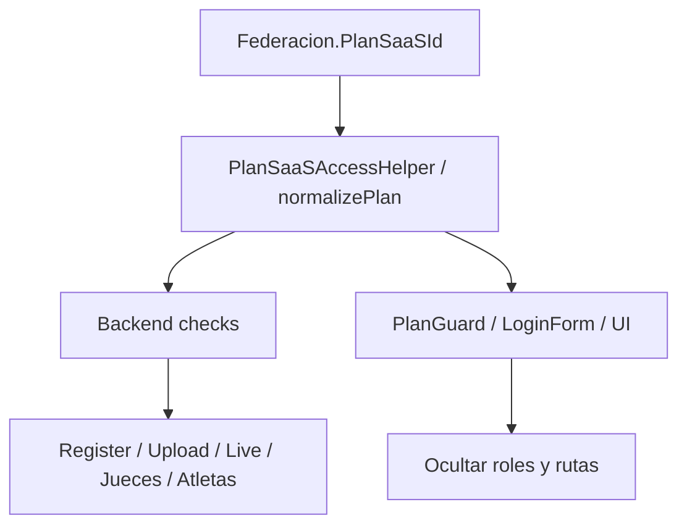

# Diseño de enforcement — planes SaaS

Fecha: 2026-07-16  
A+B+C+D+E+F+G implementados (2026-07-16). Carga manual sin jueces; MaxAtletas por fed; imágenes; Live flag; Home copy.  
Matriz de producto: plan Cursor `inventario_planes_saas`

---

## 1. Objetivo

Aplicar la matriz acordada en **tres capas** (sin romper Live público anónimo ni SuperAdmin):

1. **Datos** — seed / flags del plan  
2. **Backend** — fuente de verdad (401/403/400)  
3. **Front** — UX (ocultar opciones, PlanGuard)



---

## 2. Modelo de flags (propuesta)

### 2.1 Campos en entidad `PlanSaaS` (migración)

| Campo | Tipo | Uso |
|-------|------|-----|
| `MaxAtletas` | int | Ya existe → **200 / 400 / -1** |
| `ResultadosTiempoReal` | bool | Live público SignalR (ST/Dúo **M+L**) |
| `ExportacionPdf` | bool | Nuevo (o reutilizar/renombrar Excel → PDF en copy; seed true en todos los que llevan PDF) |
| `AccesoDashboardClub` | bool | **Nuevo** — Club UI + rol Club |
| `PermitirCargaImagenes` | bool | **Nuevo** — upload Documentacion |

Seguir calculando en helper (no hace falta columna si se deriva por ID):

| Flag derivado | Regla |
|---------------|--------|
| `AccesoSigdef` | ids 1–3, 7–9 |
| `AccesoSportTrack` | ids 4–6, 7–9 |
| `AccesoControlesLive` | **solo** ids **6 y 9** (ST L y Dúo L). SIGDEF L (id 3) → **false** (no hay jueces en SIGDEF-only) |

### 2.2 Seed objetivo (ids fijos)

| Id | Nombre | MaxAtletas | Live | ClubDash | Imágenes | Jueces | PDF |
|----|--------|------------|------|----------|----------|--------|-----|
| 1 | SIGDEF (S) | 200 | — | no | no | — | sí |
| 2 | SIGDEF (M) | 400 | — | sí | no | — | sí |
| 3 | SIGDEF (L) | -1 | — | sí | sí | — | sí |
| 4 | SportTrack (S) | 200 | no | — | — | no | sí |
| 5 | SportTrack (M) | 400 | sí | — | — | no | sí |
| 6 | SportTrack (L) | -1 | sí | — | — | sí | sí |
| 7 | Pack Dúo (S) | 200 | no | no | no | no | sí |
| 8 | Pack Dúo (M) | 400 | sí | sí | no | no | sí |
| 9 | Pack Dúo (L) | -1 | sí | sí | sí | sí | sí |

---

## 3. Matriz de enforcement por feature

| Feature | Quién | Dónde validar |
|---------|--------|----------------|
| Entrar a app SIGDEF / SportTrack | Login `X-Client-App` | Ya: `AuthService` + `PlanGuard` |
| Tope atletas 200/400 | Alta atleta/participante | Backend `ParticipanteService` / `AtletaServices` — usar plan de **Federación** (hoy a veces Club; unificar) |
| Dashboard / login **Club** | Rol Club + rutas `/club` | Front: ocultar rol Club si `!AccesoDashboardClub`. Backend Register. PlanGuard club. |
| Carga imágenes | `POST Documentacion/upload` | Backend `FileUploadRules` / service + front ocultar upload |
| Live público (pizarra) | `/resultados/:id` SignalR tiempo real | Si `!ResultadosTiempoReal`: Live en modo **polling / estático** o mensaje “actualizá plan”; **no** exige login |
| Schedule + carga manual + DQ | Admin ST | **Disponible en S/M/L** de SportTrack/Dúo. Hoy `/jueces/carga-manual` usa `requiereControlesLive` → **separar** |
| Consolas juez | Largador/Llegada/Control | Solo `AccesoControlesLive`. Rutas + Register roles juez |
| Crear login Admin | Gestion logins | Siempre (fed con acceso gestión) |
| Crear login Club | Gestion logins | Solo `AccesoDashboardClub` |
| Crear login juez | Gestion logins | Solo `AccesoControlesLive` |
| PDF export | UI botones | Flag PDF; ocultar si false (casi siempre true en matriz) |

---

## 4. Cambio crítico: carga manual ≠ jueces

Hoy en [`App.jsx`](c:\Users\EZEQU\source\reposFront\SportTrack-Front\src\App.jsx):

```jsx
/jueces/carga-manual → requiereControlesLive
```

Según matriz, carga manual es de **Esencial**. Diseño:

| Ruta | Guard nuevo |
|------|-------------|
| `/jueces/largador`, `/llegada`, `/juez-control`, hub `/jueces` | `requiereControlesLive` |
| `/jueces/carga-manual` (o mejor `/admin/carga-manual`) | `requiereSportTrack` **sin** live |
| Eventos / schedule / start list / resultados admin | `requiereSportTrack` |

Opcional UX: sacar “carga manual” del módulo jueces y ponerla bajo panel Admin eventos.

---

## 5. Backend — puntos concretos

### 5.1 Helper central

Archivo: [`PlanSaaSAccessHelper.cs`](c:\Users\EZEQU\source\repos\SportTrack-Sigdef\SportTrack-Sigdef.Controladores\SaaS\PlanSaaSAccessHelper.cs)

- Actualizar `ResolveByPlanId`: live solo **6 y 9** (quitar live en id 3).  
- Exponer `AccesoDashboardClub`, `PermitirCargaImagenes`, `ExportacionPdf` (desde entidad o por ID).  
- Método sugerido: `CanCreateRole(plan, rol)` → true/false.

### 5.2 `AuthService.RegisterAsync`

- Resolver plan de la federación destino (`FederacionId` / club→fed).  
- Si rol `Club` y `!AccesoDashboardClub` → 400.  
- Si rol juez y `!AccesoControlesLive` → 400.  
- SuperAdmin creando para una fed: **aplicar plan de esa fed** (no bypass), salvo flag interno opcional.

### 5.3 Atletas / participantes

- `Create*`: contar atletas activos del scope federación; si `MaxAtletas > 0` y count ≥ max → 400.  
- Fuente del plan: **Federacion.PlanSaaSId** (no solo Club).

### 5.4 Documentacion upload

- Si `!PermitirCargaImagenes` → 403.  
- Mantener MIME/size de Fase 3.

### 5.5 Live / hub (opcional fase 1 del enforcement)

- Broadcast de tiempos puede seguir; el **front Live** decide polling vs SignalR según `ResultadosTiempoReal` del evento/federación (endpoint público puede incluir flag mínimo en DTO evento).  
- Hub acciones juez ya exigen JWT+roles (Fase 1 seguridad); sin login juez no hay consola.

### 5.6 DTO login /me

Devolver en `plan` todos los flags nuevos para que el front no hardcodee IDs de más.

---

## 6. Front — puntos concretos

### 6.1 `planHelpers.js` (SportTrack-Front + FrontSigdef)

```text
normalizePlan → + accesoDashboardClub, permitirCargaImagenes,
                 resultadosTiempoReal, exportacionPdf, maxAtletas
canCreateClubLogin(plan)
canCreateJudgeLogin(plan)  // alias canAccessControlesLive
canAccessLiveResults(plan) // ResultadosTiempoReal
```

Alinear IDs: live solo 6 y 9.

### 6.2 `LoginForm.jsx` / `GestionLoginsSection.jsx`

- Deshabilitar/ocultar **Club** si `!accesoDashboardClub` (igual que jueces).  
- Default rol al fallar: `Admin` (no `Club` como hoy cuando fallan jueces).  
- Labels: “(Desde Plan Profesional)” / “(Exclusivo Ecosistema)”.

### 6.3 `PlanGuard` / `ProtectedRoute` / `App.jsx`

- Nuevas props: `requiereDashboardClub`, `requiereSportTrack` (ya), `requiereControlesLive` (ya).  
- **Quitar** `requiereControlesLive` de carga-manual.  
- FrontSigdef: rutas club admin → `requiereDashboardClub`.

### 6.4 Uploads / Live UI

- Ocultar botones imagen si `!permitirCargaImagenes`.  
- `LiveResults`: si evento sin tiempo real → polling o aviso; no romper ruta pública.

### 6.5 Home marketing

- Actualizar bullets de [`Home.jsx`](c:\Users\EZEQU\source\reposFront\SportTrack-Front\src\pages\Home\Home.jsx) a la matriz (200/400, sin jueces en S/M, Live desde Profesional, etc.).  
- Deprecar Bronce/Plata/Oro en `PlanDetails.jsx`.

---

## 7. Orden de implementación sugerido

| Paso | Trabajo | Riesgo |
|------|---------|--------|
| A | Migración + seed MaxAtletas/flags + helper/DTO | Bajo (datos) |
| B | Register + LoginForm roles Club/jueces | Medio (UX admin) |
| C | Separar carga-manual de `requiereControlesLive` | Medio (rompe expectativa actual de “todo en jueces”) |
| D | Tope atletas por federación | Medio |
| E | Gate upload imágenes | Bajo |
| F | Live público según `ResultadosTiempoReal` | Medio (QA Live) |
| G | Home copy + PlanGuard Club | Bajo |

Cada paso con smoke: login fed S no ve Club/jueces; fed L sí; carga manual en S; jueces solo L; Live en M+.

---

## 8. Fuera de alcance (por ahora)

- Fees % torneos, white label, app móvil, GPS, API pública  
- Mensajería / campañas por plan (se puede añadir flag después)  
- Mercado Pago webhook  
- Cookie-first JWT  

---

## 9. Criterio de “diseño listo → implementar”

Con este doc alcanza para codear. Al implementar, empezar por **Paso A + B** (flags + creación de logins), que es lo que pediste explícitamente sobre federación plan S.
