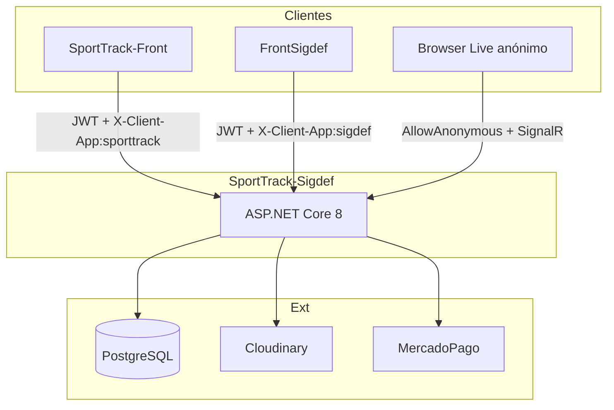
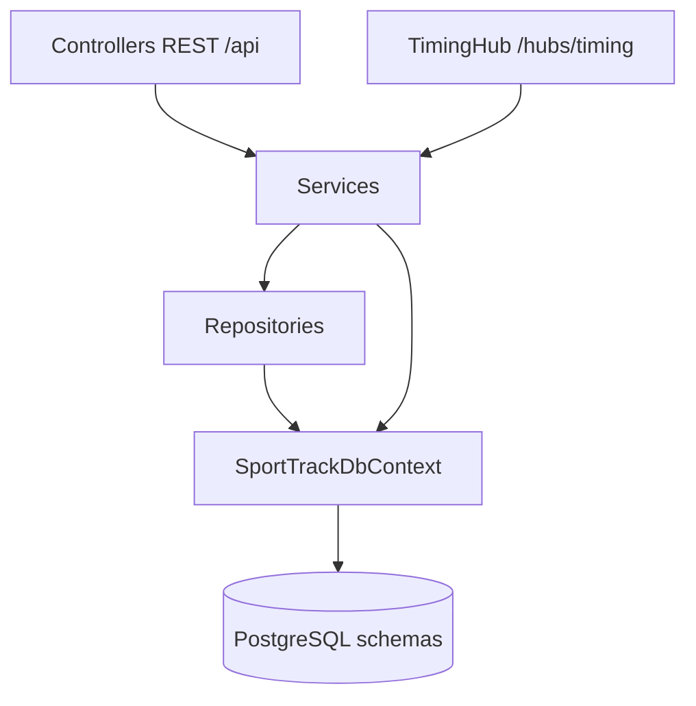
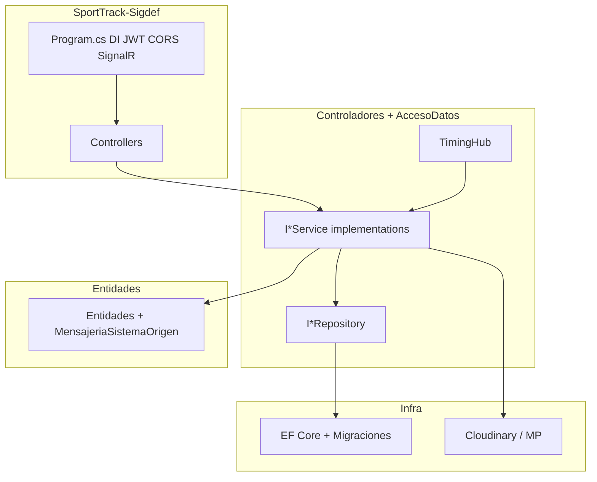
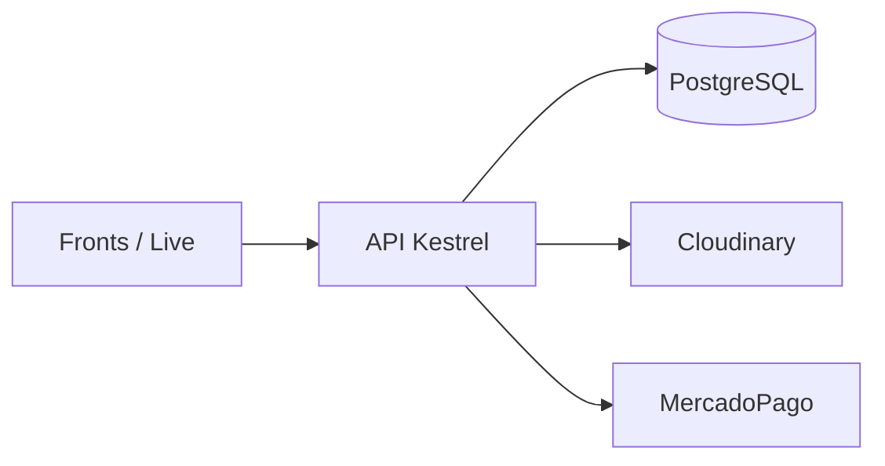
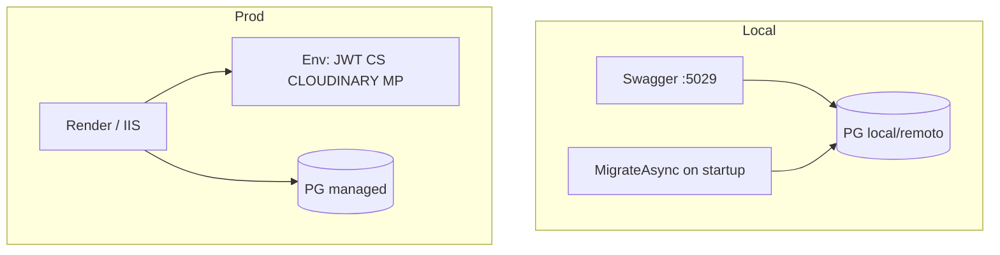
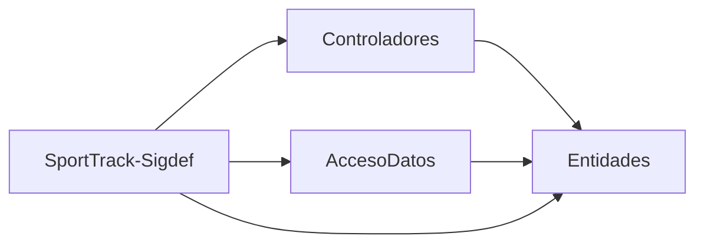
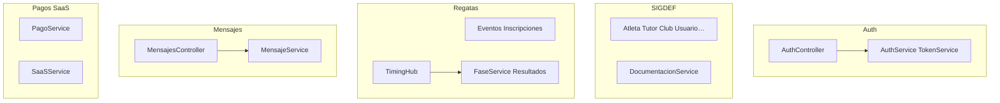

# 01 — Globales (API)

## 1. Contexto

---

## 2. Contenedores

---

## 3. Capas

---

## 4. Despliegue

---

## 5. Despliegue detallado

Ver [../../guias/operacion-local.md](../../guias/operacion-local.md).

---

## 6. Paquetes de la solución

---

## 7. Componentes API (módulos)

