# 02 — Casos de uso, actividad y estados (API)

## 1. Casos de uso (capacidades expuestas)

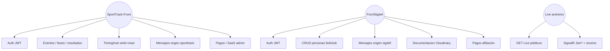

---

## 2. Actividad

### Request autenticado típico

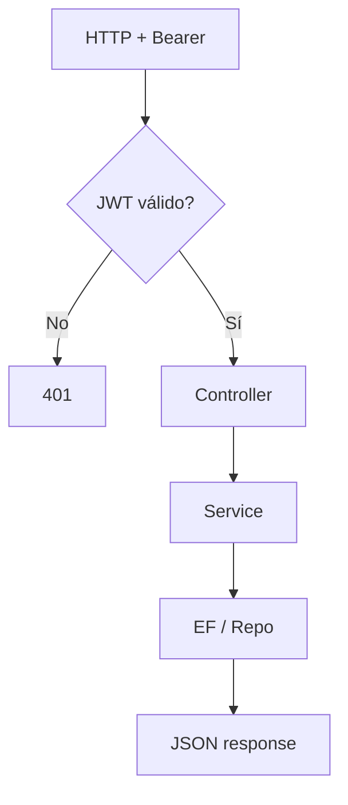

### Crear hilo con aislamiento

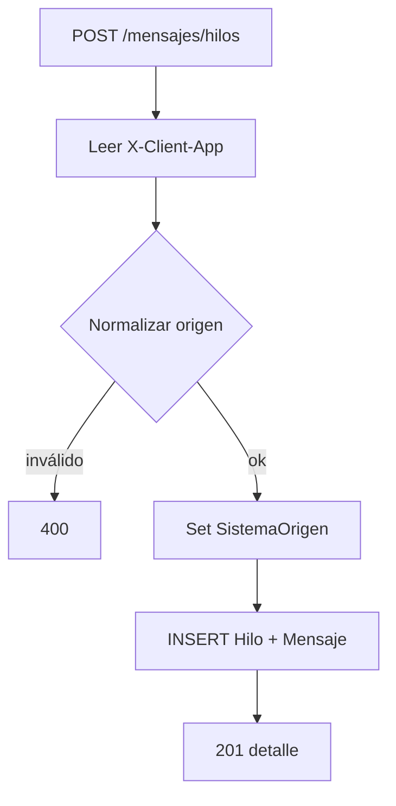

### Start race vía Hub

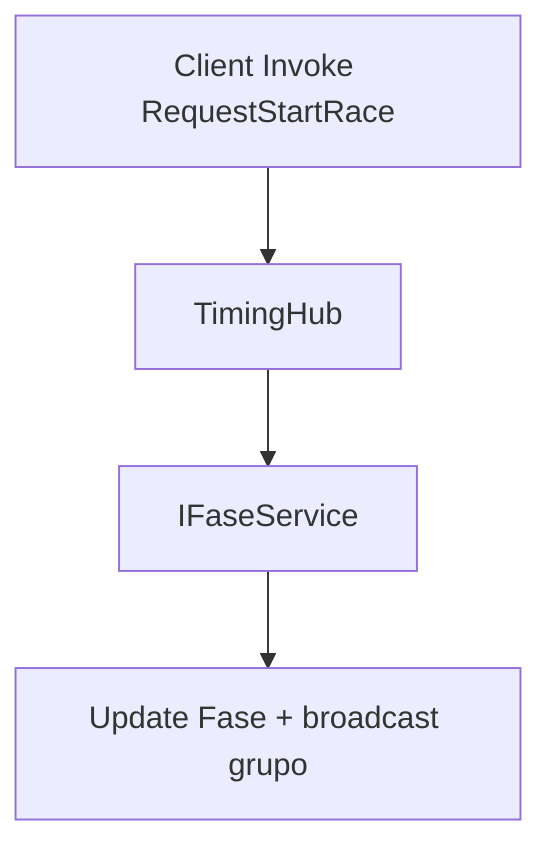

### Migración al arrancar

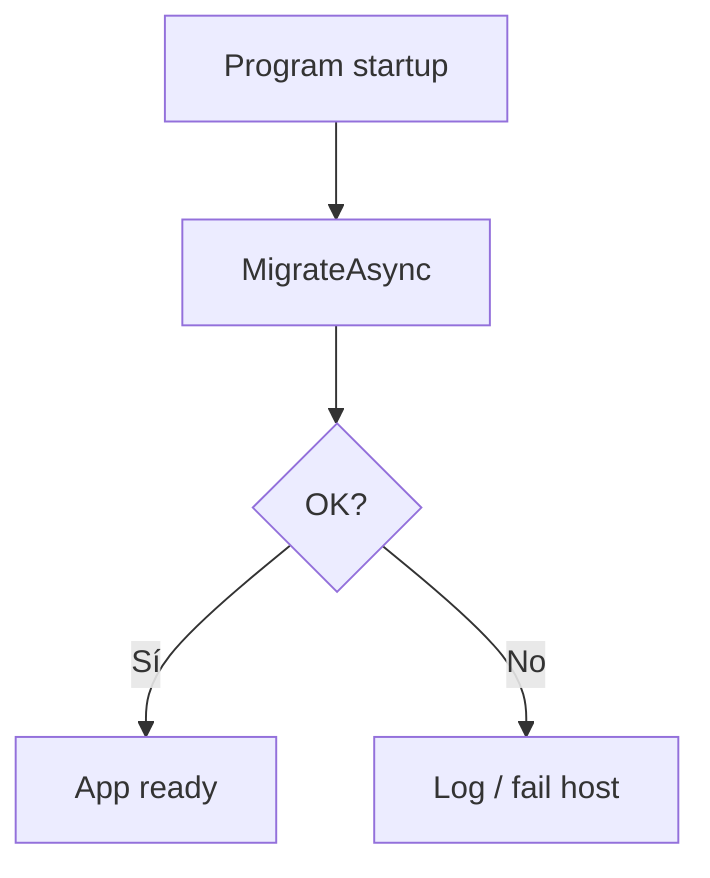

---

## 3. Estados (persistidos / runtime)

Documentación completa SportTrack (evento, fases, resultados, inscripciones):  
[../estados-eventos-fases-sporttrack.md](../estados-eventos-fases-sporttrack.md)

### Usuario

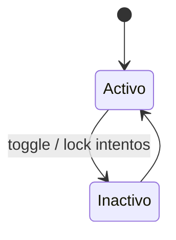

### Evento (SportTrack)

Sync **automático** por fechas + override **manual** admin. `Cancelado` no se toca.

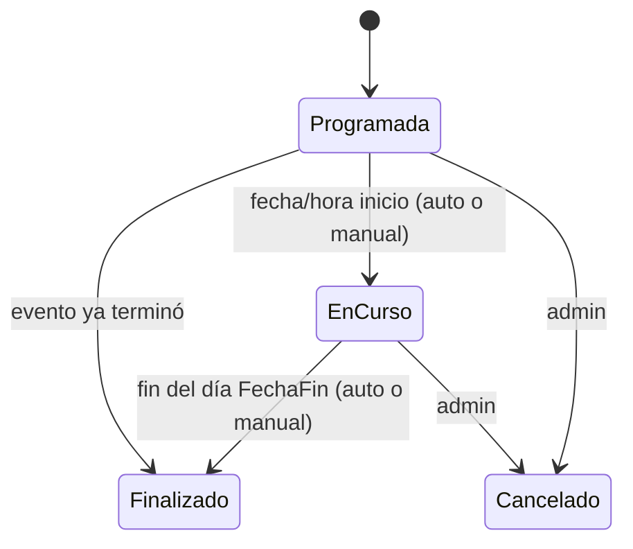

### Fase (serie / carrera)

Sync **manual** vía jueces (API `/api/fases/{id}/...`).

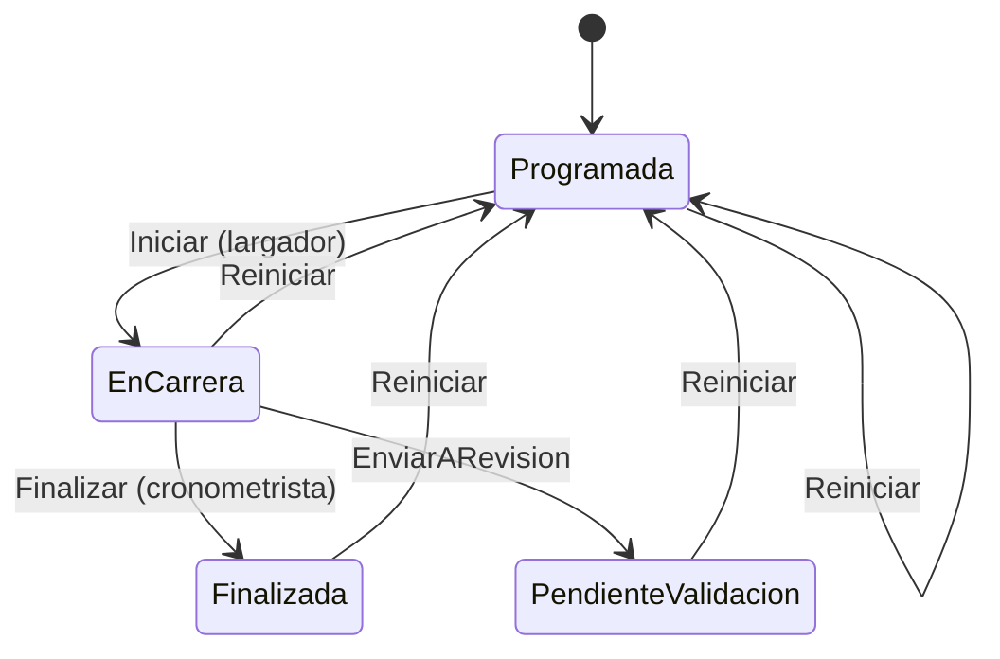

### Resultado (por carril)

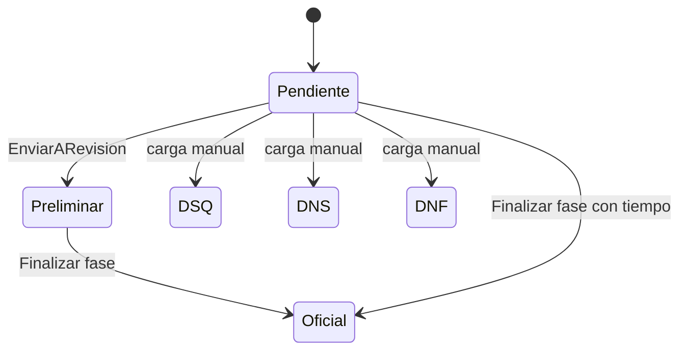

### Hilo/Mensaje

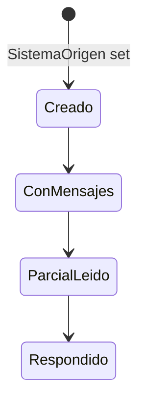

### PagoFederacionTransaccion

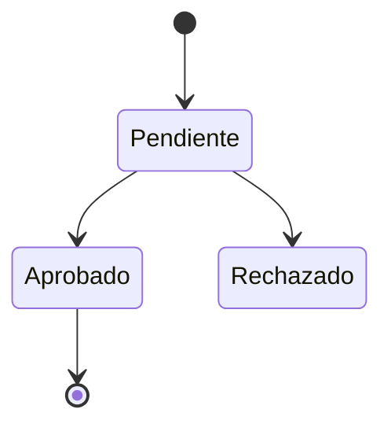
