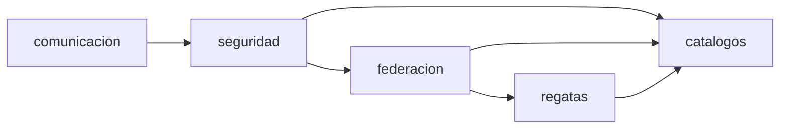
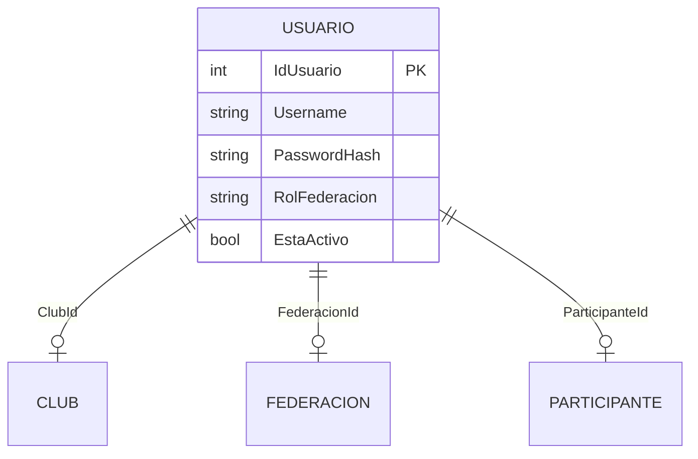
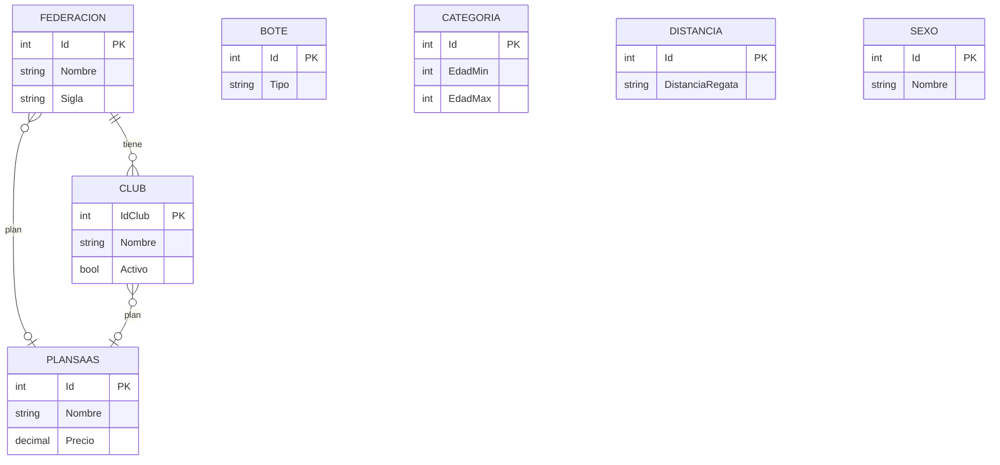
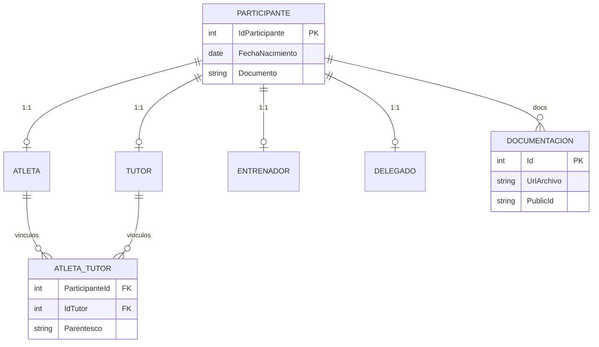
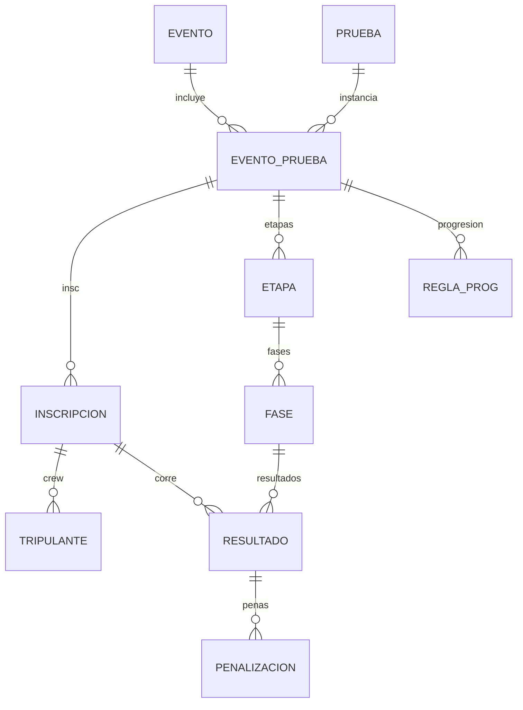
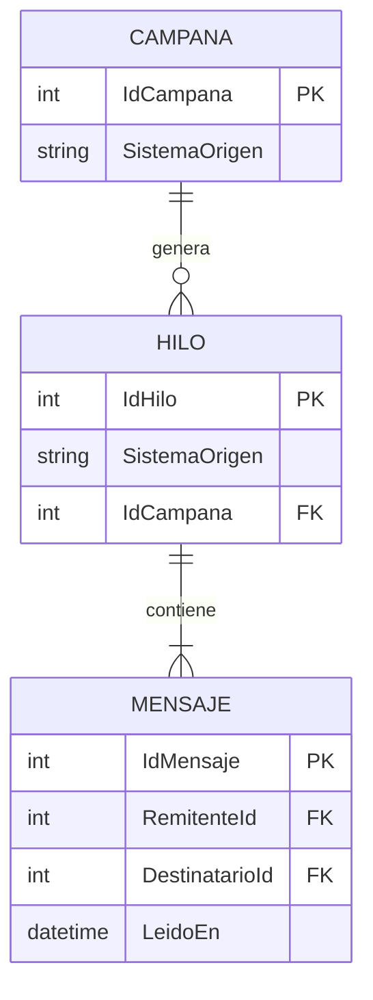
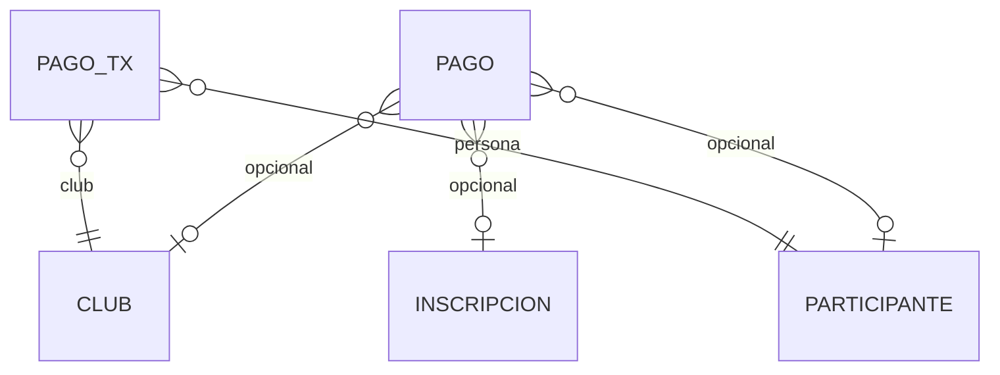
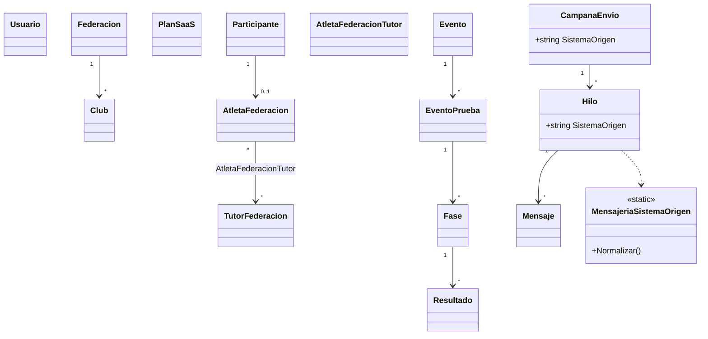

# 03 — ER y clases de dominio (API canónica)

Schemas: `seguridad`, `federacion`, `catalogos`, `regatas`, `comunicacion` (+ `Auditoria`).

Mappings detallados por entidad: `SportTrack-Sigdef.Entidades/Docs/Mappings/`.

---

## 1. Mapa de schemas

---

## 2. ER — seguridad

---

## 3. ER — federacion / catalogos

---

## 4. ER — personas

---

## 5. ER — regatas

---

## 6. ER — comunicacion

---

## 7. ER — pagos

---

## 8. Clases dominio — núcleo

Ver también guía [../../guias/mensajeria-aislamiento.md](../../guias/mensajeria-aislamiento.md).
