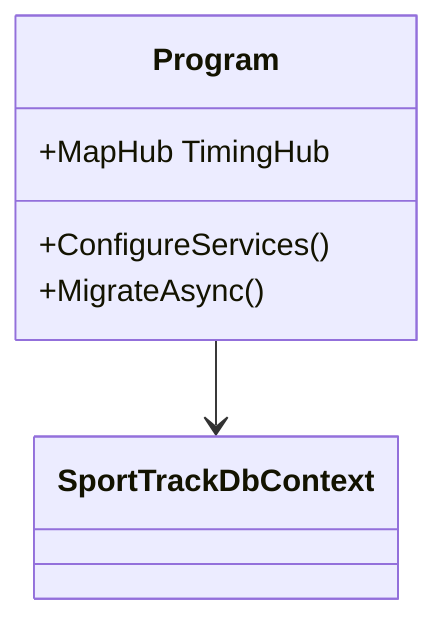
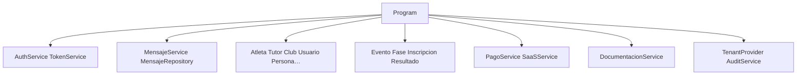
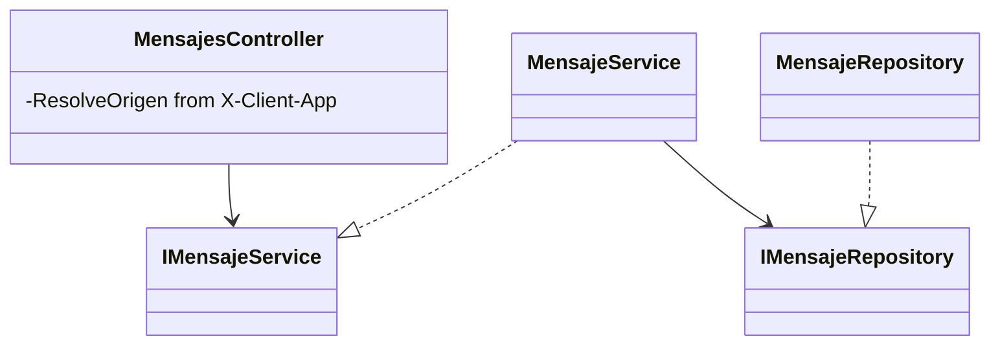
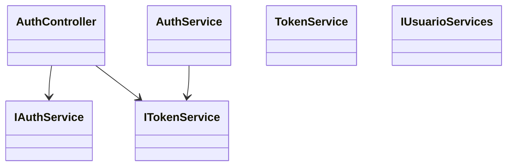
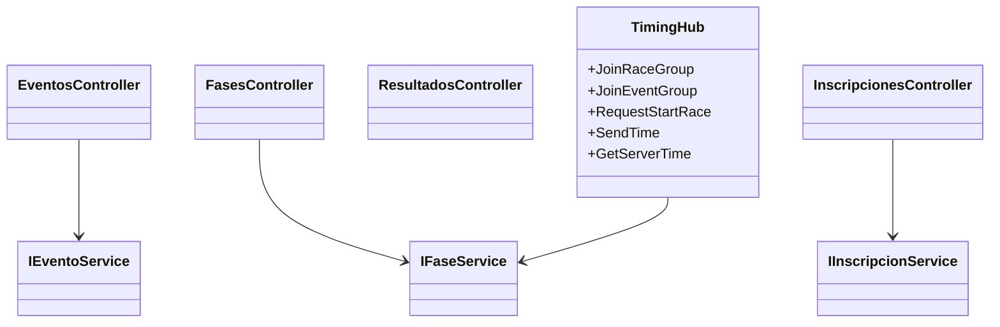
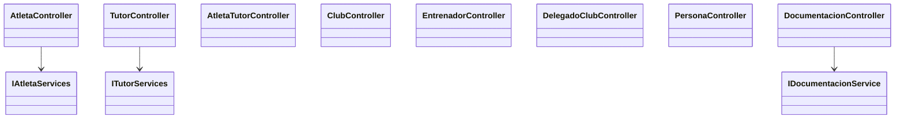
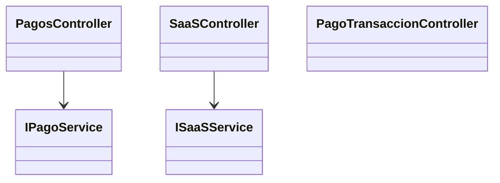

# 04 — Clases de aplicación (API)

## 1. Host / DI

```mermaid
classDiagram
    class Program {
        +ConfigureServices()
        +MigrateAsync()
        +MapHub TimingHub
    }
    class SportTrackDbContext
    Program --> SportTrackDbContext
```

```mermaid
flowchart TB
    Program --> Auth[AuthService TokenService]
    Program --> Msg[MensajeService MensajeRepository]
    Program --> Sig[Atleta Tutor Club Usuario Persona…]
    Program --> Reg[Evento Fase Inscripcion Resultado]
    Program --> Pay[PagoService SaaSService]
    Program --> Doc[DocumentacionService]
    Program --> Ten[TenantProvider AuditService]
```

---

## 2. Mensajería

```mermaid
classDiagram
    class MensajesController {
        -ResolveOrigen from X-Client-App
    }
    class IMensajeService
    class MensajeService
    class IMensajeRepository
    class MensajeRepository
    MensajesController --> IMensajeService
    MensajeService ..|> IMensajeService
    MensajeService --> IMensajeRepository
    MensajeRepository ..|> IMensajeRepository
```

---

## 3. Auth

```mermaid
classDiagram
    class AuthController
    class IAuthService
    class AuthService
    class ITokenService
    class TokenService
    class IUsuarioServices
    AuthController --> IAuthService
    AuthController --> ITokenService
    AuthService --> ITokenService
```

---

## 4. Regatas / Timing

```mermaid
classDiagram
    class EventosController
    class FasesController
    class ResultadosController
    class InscripcionesController
    class TimingHub {
        +JoinRaceGroup
        +JoinEventGroup
        +RequestStartRace
        +SendTime
        +GetServerTime
    }
    class IEventoService
    class IFaseService
    class IInscripcionService
    EventosController --> IEventoService
    FasesController --> IFaseService
    TimingHub --> IFaseService
    InscripcionesController --> IInscripcionService
```

---

## 5. SIGDEF CRUD

```mermaid
classDiagram
    class AtletaController
    class TutorController
    class AtletaTutorController
    class ClubController
    class EntrenadorController
    class DelegadoClubController
    class PersonaController
    class DocumentacionController
    class IAtletaServices
    class ITutorServices
    class IDocumentacionService
    AtletaController --> IAtletaServices
    TutorController --> ITutorServices
    DocumentacionController --> IDocumentacionService
```

---

## 6. Pagos / SaaS

```mermaid
classDiagram
    class PagosController
    class SaaSController
    class PagoTransaccionController
    class IPagoService
    class ISaaSService
    PagosController --> IPagoService
    SaaSController --> ISaaSService
```
