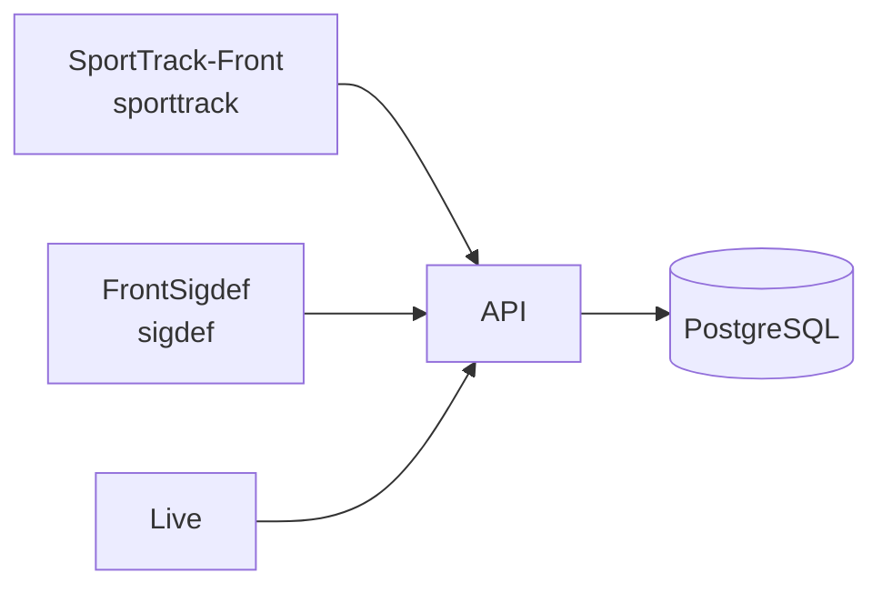
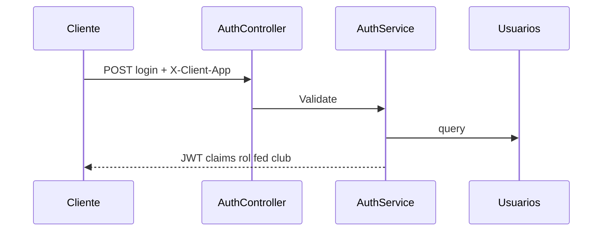
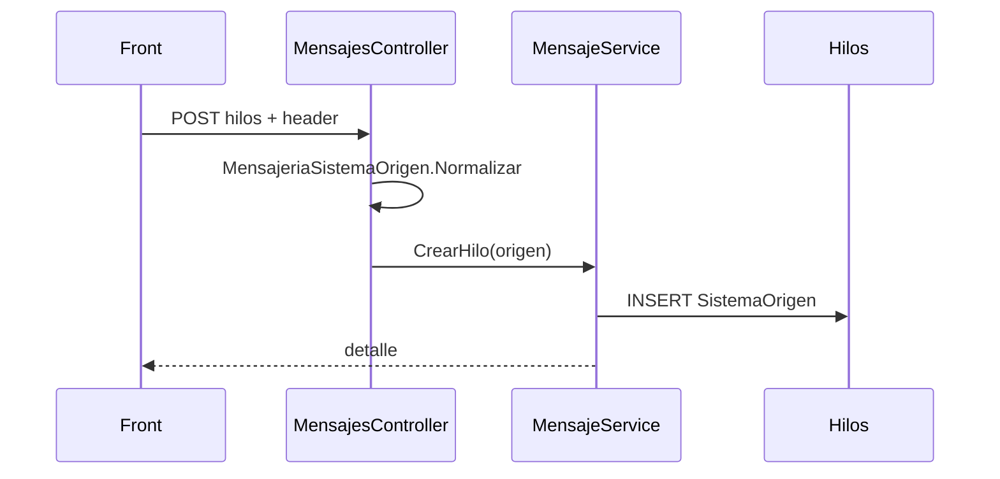
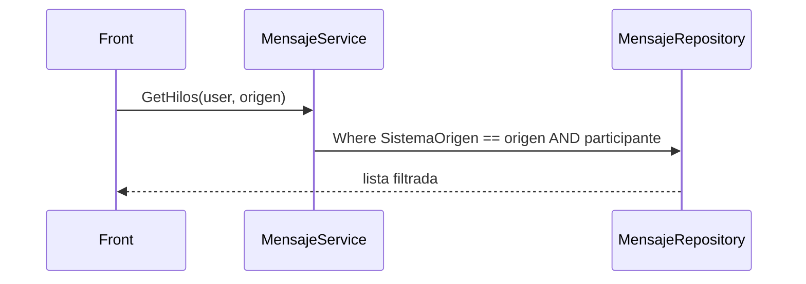
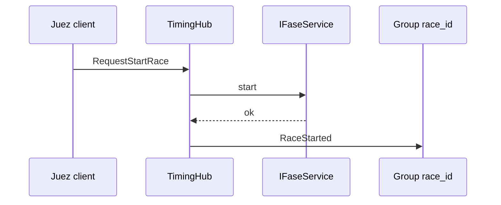
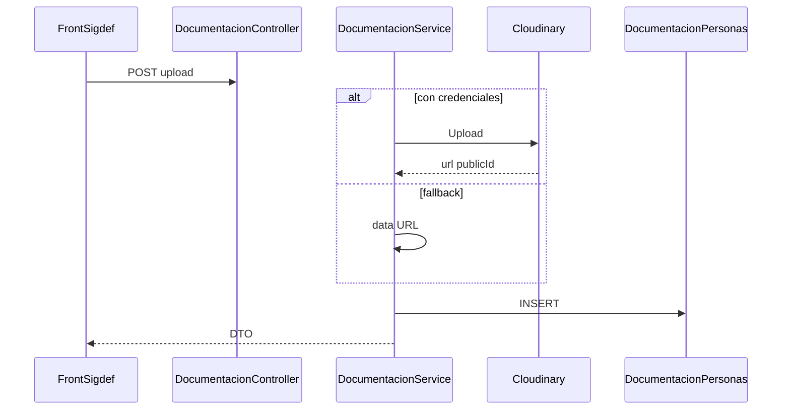
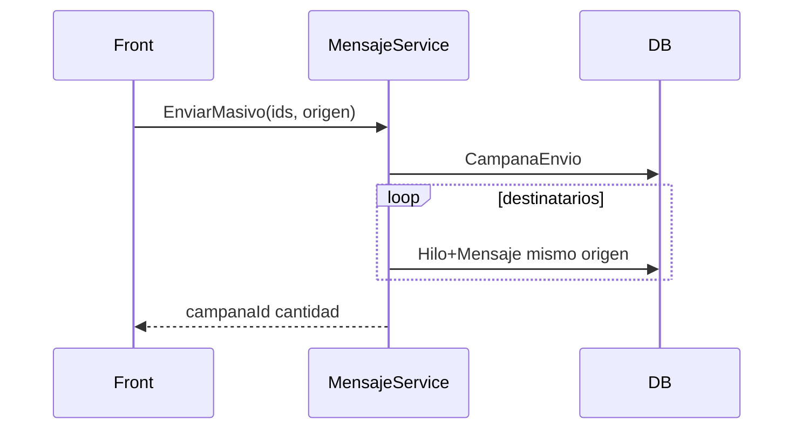
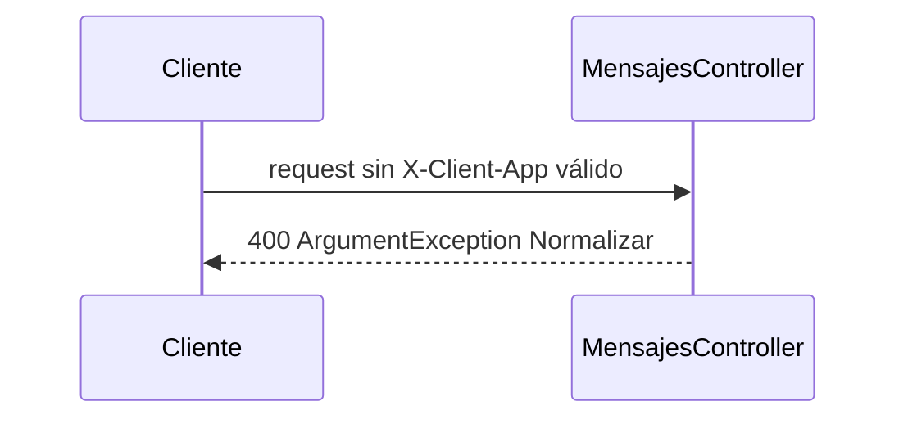

# 05 — Secuencias y contratos (API)

## Red / clientes

### Contratos clave

| Área | Prefijo | Notas |
|------|---------|-------|
| Auth | `/api/Auth` | Login lee `X-Client-App` |
| Mensajes | `/api/mensajes` | Origen obligatorio |
| SIGDEF | `/api/Atleta`, `/Tutor`, `/Club`, … | JWT + roles |
| Regatas | `/api/Eventos`, `/Fases`, `/Resultados` | |
| Hub | `/hubs/timing` | Grupos race_/event_ |
| Docs | `/api/Documentacion` | Cloudinary opcional |
| Health | `/api/Health` | |

---

## 1. Login

---

## 2. Mensaje con SistemaOrigen

---

## 3. Filtro listado hilos

---

## 4. TimingHub start + broadcast

---

## 5. Upload documentación

---

## 6. Masivo campañas

---

## 7. Error header inválido

