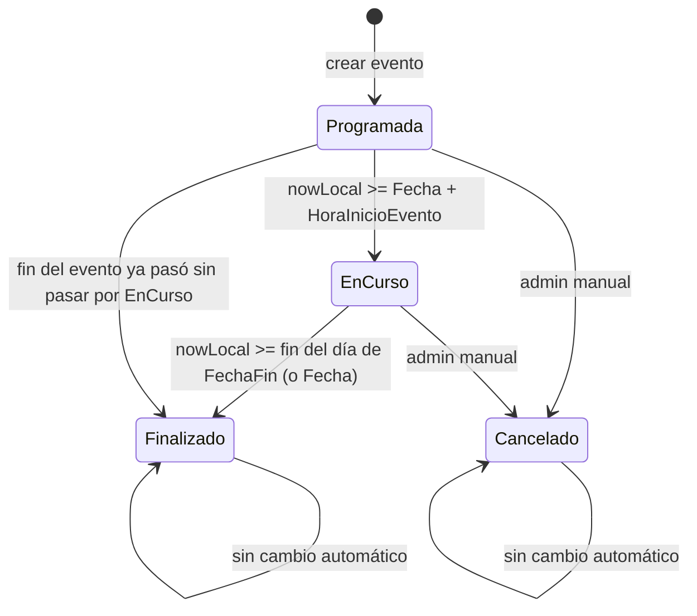
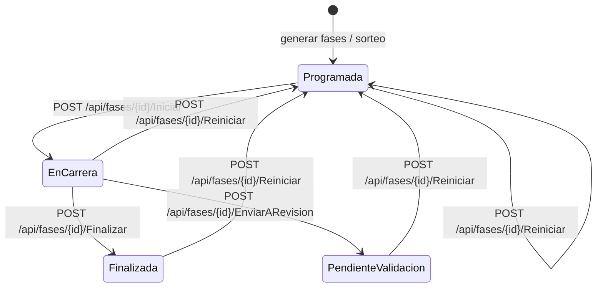

# Estados de eventos, fases y resultados (SportTrack)

**Alcance:** módulo de competencia de **SportTrack** (regatas, timing, inscripciones a eventos).  
**No aplica a:** gestión federativa SIGDEF (atletas, traspasos, afiliación).

**Última actualización:** 2026-07-21

---

## Jerarquía

```text
Evento (torneo / regata)
  └── EventoPrueba (prueba habilitada en el evento)
        └── Fase (serie, semifinal, final…)
              └── Resultado (por carril / inscripción)
```

Cada nivel tiene su propio campo `Estado`. Además, el **evento** expone la propiedad calculada `InscripcionesAbiertas`, que no es un enum sino una regla de negocio.

---

## 1. Estado del evento (`Evento.Estado`)

### Valores (`EstadoEventoEnum`)

| Valor API | Etiqueta UI | Descripción |
|-----------|-------------|-------------|
| `Programada` | Programado / Programada | Evento creado; aún no comenzó la competencia |
| `EnCurso` | En Curso | Dentro del período del evento |
| `Finalizado` | Finalizado | Período del evento concluido |
| `Cancelado` | Cancelado | Suspendido; no se modifica automáticamente |

**Tabla:** `regatas.Eventos` · **Enum:** `SportTrack-Sigdef.Entidades/Enums/EstadoEventoEnum.cs`

### Transiciones automáticas (desde 2026-07-21)

Los eventos en `Programada` o `EnCurso` se sincronizan según fechas y zona horaria del evento (`TimeZoneId`, default `America/Argentina/Buenos_Aires`).



#### Reglas de cálculo

| Condición (hora local del evento) | Estado resultante |
|-----------------------------------|-------------------|
| `now >= fin del día de (FechaFin ?? Fecha)` | `Finalizado` |
| `now >= Fecha + HoraInicioEvento` | `EnCurso` |
| En otro caso | `Programada` |
| `Estado == Cancelado` | Se mantiene `Cancelado` |

- **Inicio:** fecha de inicio (`Fecha`) + `HoraInicioEvento` (ej. 08:00).
- **Fin:** último instante del día de `FechaFin`; si no hay `FechaFin`, se usa `Fecha` (evento de un día).
- **Solo avanza:** si un admin adelantó manualmente el estado (ej. `EnCurso` antes de la hora de inicio), el sync **no retrocede** el enum.

#### Cuándo se ejecuta el sync

| Momento | Componente |
|---------|------------|
| Arranque de la API (post-migraciones) | `Program.cs` → `IEventoEstadoSyncService.SyncAllAsync()` |
| Cada **15 minutos** | `EventoEstadoBackgroundService` |
| `GET` listado / próximos eventos | `EventoService.GetAllEventosAsync` / `GetProximosEventosAsync` |
| `GET` evento por id | `EventoService.GetEventoByIdAsync` → `SyncEventoAsync(id)` |

#### Código

| Archivo | Rol |
|---------|-----|
| `Controladores/Evento/EventoEstadoSyncHelper.cs` | Cálculo puro del estado |
| `Controladores/Evento/EventoEstadoSyncService.cs` | Persistencia en BD |
| `Controladores/Evento/EventoEstadoBackgroundService.cs` | Job periódico |
| `Controladores/Evento/EventoService.cs` | Sync al consultar |

### Transición manual (admin federación)

Un admin puede cambiar `Estado` al editar el evento (`PUT /api/eventos/{id}`), selector en SportTrack-Front `EventForm.jsx`.

- Valores aceptados en front: `Programado`, `EnCurso`, `Finalizado`, `Cancelado` (el backend persiste el enum, p. ej. `Programada`).
- `Cancelado` y `Finalizado` quedan fuera del sync automático (no se vuelven a evaluar en background).

---

## 2. Inscripciones abiertas (`EventoDto.InscripcionesAbiertas`)

Propiedad **calculada**, no persistida. Determina si clubes pueden inscribir o eliminar inscripciones.

```csharp
InscripcionesHabilitadas
  && Estado == "Programada"
  && (FechaFinInscripciones == null || FechaFinInscripciones > UtcNow)
```

| Regla | Efecto |
|-------|--------|
| `InscripcionesHabilitadas == false` | Cerradas |
| `Estado != Programada` (p. ej. `EnCurso`) | Cerradas |
| Pasó `FechaFinInscripciones` | Cerradas |
| Resto | Abiertas |

**Importante:** las inscripciones pueden cerrarse **antes** de que el evento pase a `EnCurso`, solo por la fecha de cierre.

**Backend delete inscripción (club):** rechazado si el evento no permite modificar inscripciones (`InscripcionService.DeleteInscripcionAsync`). Admin / SuperAdmin pueden forzar.

**Front SportTrack:** `src/utils/inscripcionUtils.js` → `areInscripcionesAbiertas()`.

---

## 3. Estado de la fase (`Fase.Estado`)

Una **fase** es una serie/carrera dentro de una prueba (ej. "Serie 1", "Final A").  
**Tabla:** `regatas.Fases` · **Tipo:** `string` (no enum en BD).

### Valores y transiciones



| Estado fase | Disparador | Actor típico | Efectos colaterales |
|-------------|------------|--------------|---------------------|
| `Programada` | Creación (`GenerarFases`, manual, promoción) | Admin / sistema | Resultados en `Pendiente` |
| `En Carrera` | `IniciarFaseAsync` | Juez de salida (Largador) | `FechaHoraInicioReal`; SignalR `RaceStarted` |
| `Finalizada` | `FinalizarFaseAsync` | Cronometrista | Posiciones; resultados con tiempo → `Oficial`; SignalR `RaceFinished` |
| `Pendiente de Validación` | `EnviarARevisionAsync` | Cronometrista / control | Tiempos → `Preliminar`; SignalR `RaceInReview` |
| `Programada` (reset) | `ReiniciarFaseAsync` | Admin / juez | Limpia tiempos; resultados → `Pendiente`; SignalR `RaceReset` |

**Nota:** en código y UI a veces aparece `En Carrera` (con espacio). El front de jueces compara contra `Programada` para habilitar el botón de salida.

### API (`FasesController`)

| Método | Ruta | Auth |
|--------|------|------|
| POST | `/api/fases/{id}/Iniciar` | CompetitionOperators |
| POST | `/api/fases/{id}/Finalizar` | CompetitionOperators |
| POST | `/api/fases/{id}/Reiniciar` | CompetitionOperators |
| POST | `/api/fases/{id}/EnviarARevision` | CompetitionOperators |
| DELETE | `/api/fases/{id}` | CompetitionOperators |

**Servicio:** `Controladores/Fase/FaseService.cs`

### Relación con el estado del evento

El estado del **evento** y el de cada **fase** son **independientes**:

- Un evento puede estar `EnCurso` mientras algunas fases siguen `Programada` y otras `Finalizada`.
- Iniciar una fase **no** cambia `Evento.Estado` (solo el sync automático o un admin lo hace).

---

## 4. Estado del resultado (`Resultado.Estado`)

Por cada carril/inscripción dentro de una fase.  
**Enum:** `EstadoResultadoEnum` · **Tabla:** `regatas.Resultados`

| Valor | Significado | Cuándo se asigna |
|-------|-------------|------------------|
| `Pendiente` | Sin tiempo oficial | Alta de fase / reinicio / sin tiempo cargado |
| `Preliminar` | Tiempo cargado, no oficializado | `EnviarARevision` |
| `Oficial` | Tiempo válido para clasificación | `FinalizarFase` (con `TiempoOficial`) |
| `Descalificado` | DSQ | Carga manual / reglas |
| `DNS` | No largó | Carga manual |
| `DNF` | No terminó | Carga manual |
| `Revisado` | Revisión administrativa | Flujos de corrección |

Al **finalizar** fase: se ordena por tiempo, se asigna posición y `Oficial` a quienes tienen tiempo (excluye DSQ/DNS/DNF).

---

## 5. Estado de inscripción (`Inscripcion.Estado`)

**Enum:** `EstadoInscripcionEnum` · Valores: `Inscrito`, `Confirmado`, `Retirado`, `Ausente`.

Independiente del estado del evento o de la fase. Campo aparte: `Inscripcion.Pagado` (bool) para pagos de inscripción al evento.

---

## 6. Estado de EventoPrueba (`EventoPrueba.Estado`)

Usa el mismo enum `EstadoEventoEnum` que el evento, con default `Programada`.  
Hoy **no** tiene sync automático dedicado; la competencia operativa se sigue por **fases**.

---

## 7. Vista integrada (competencia en curso)

```text
Evento: EnCurso                    ← automático por fechas
  InscripcionesAbiertas: false     ← por estado + fecha cierre
  EventoPrueba: K1 200m Cadete
    Fase "Serie 1": Finalizada     ← juez finalizó
    Fase "Serie 2": En Carrera      ← largador inició
    Fase "Final": Programada        ← aún no corre
```

---

## 8. SignalR (timing en vivo)

Eventos emitidos al cambiar estado de **fase** (TimingHub):

| Evento | Cuándo |
|--------|--------|
| `RaceStarted` / `globalRaceStarted` | Fase → `En Carrera` |
| `RaceFinished` / `globalRaceOfficialized` | Fase → `Finalizada` |
| `RaceInReview` | Fase → `Pendiente de Validación` |
| `RaceReset` | Fase → `Programada` (reinicio) |

---

## 9. Referencias cruzadas

| Documento | Contenido |
|-----------|-----------|
| [diagramas/02-casos-actividad-estados.md](./diagramas/02-casos-actividad-estados.md) | Diagramas resumidos |
| [../cambios/2026-07-estados-eventos-automaticos.md](../cambios/2026-07-estados-eventos-automaticos.md) | Changelog del sync automático |
| `Controladores/Docs/Mappings/Evento_Mapping.md` | Mapping entidad ↔ DTO evento |
| `Controladores/Docs/Mappings/Fase_Mapping.md` | Mapping fases |

---

## 10. Checklist operativo

| Pregunta | Dónde mirar |
|----------|-------------|
| ¿Pueden inscribirse clubes? | `InscripcionesAbiertas` + `fechaFinInscripciones` |
| ¿Empezó la regata a nivel torneo? | `Evento.Estado` (`EnCurso` / sync automático) |
| ¿Se puede largar una serie? | `Fase.Estado == Programada` |
| ¿Resultados son oficiales? | `Fase.Estado == Finalizada` y `Resultado.Estado == Oficial` |
| ¿Hubo reset de una carrera? | Auditoría `RESET_RACE` / fase vuelve a `Programada` |
